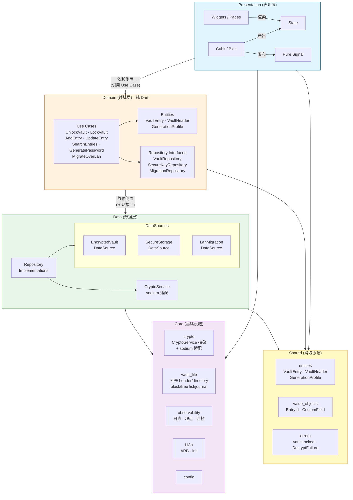
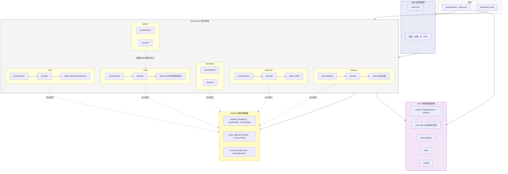

# 架构设计文档 · PROJECT_SW

> 本文档描述 PROJECT_SW 的系统架构。密码学细节以 [SECURITY.md](./SECURITY.md) 为准,本文只引用其结论。

## 1. 设计原则

1. **Clean Architecture** —— 依赖方向单向向内:presentation → domain ← data。内层(domain)不依赖任何外层框架。
2. **本地优先** —— 所有持久化与加解密在设备本地完成,无网络依赖(局域网迁移为唯一例外,且作为独立 data source 隔离)。
3. **可测试性** —— domain 层为纯 Dart,可脱离 Flutter/平台 SDK 单测;data 层通过接口注入便于 mock。
4. **响应式状态** —— 表现层使用 Cubit/Bloc + State + Pure Signal,UI 为状态的纯函数。
5. **加密方案与实现解耦** —— 密码学操作收敛到一个 `CryptoService` 抽象,底层可替换(`sodium` ↔ 纯 Dart),信封架构不绑死具体库。

## 2. 分层结构

```
┌─────────────────────────────────────────────────────────┐
│  Presentation (表现层)                                   │
│  Widgets · Pages · Cubit/Bloc · State · Pure Signal      │
└──────────────────────────┬──────────────────────────────┘
                           │ 依赖倒置(调用 use case)
┌──────────────────────────▼──────────────────────────────┐
│  Domain (领域层)  —— 纯 Dart,无 Flutter/平台依赖          │
│  Entities · Use Cases · Repository Interfaces            │
└──────────────────────────┬──────────────────────────────┘
                           │ 依赖倒置(实现接口)
┌──────────────────────────▼──────────────────────────────┐
│  Data (数据层)                                            │
│  Repository Implementations · DataSources                │
│  ┌──────────────┐ ┌──────────────┐ ┌──────────────────┐ │
│  │ EncryptedVault│ │ SecureStorage │ │ LanMigrationDS  │ │
│  │ DataSource    │ │ DataSource    │ │ (网络/传输)      │ │
│  │ (本地加密库)   │ │ (Keychain/    │ │                 │ │
│  │               │ │  Keystore)    │ │                 │ │
│  └──────────────┘ └──────────────┘ └──────────────────┘ │
└─────────────────────────────────────────────────────────┘
```

### 2.1 Presentation 层
- **Widgets/Pages**:仅负责渲染与事件上报,不持有业务逻辑。
- **Cubit/Bloc**:承接 UI 事件,调用 domain use case,产出 State。认证业务线中的 `AuthCubit` 只投影全局会话真相源,不作为会话状态机本体(见 [ADR-0010](./adr/0010-global-session-source-of-truth-and-step-up-auth.md))。
- **State**:不可变值对象,描述某一时刻的界面。
- **Pure Signal**:用于跨组件、跨 Bloc 的细粒度响应式信号(如解锁状态、搜索关键词),避免不必要的重建。

### 2.2 Domain 层
- **Entities**:`VaultEntry`(完整条目明文实体,规格见 [specs/vault_entry.md](./specs/vault_entry.md))、解锁态摘要模型(见 [ADR-0007](./adr/0007-unlocked-residency-and-summary-detail-split.md))、`GenerationProfile` 等纯数据模型。`VaultHeader` 对应 SECURITY `File Header`(见 [specs/vault_format.md §3](./specs/vault_format.md))。
- **Use Cases**:`UnlockVault`、`LockVault`、`AddEntry`、`UpdateEntry`、`SearchEntries`、`GeneratePassword`(规格见 §9)、`MigrateOverLan` 等,封装单一业务用例。错误模型遵循 [ADR-0009](./adr/0009-error-model-and-result-boundary.md):默认成功返回/异常上抛,仅少量交互型预期失败 use case 返回专属 `Result` failure。高敏操作是否需要主密码 step-up 由全局会话真相源统一判定(见 [ADR-0010](./adr/0010-global-session-source-of-truth-and-step-up-auth.md))。
- **Repository Interfaces**:`VaultRepository`、`SecureKeyRepository`、`MigrationRepository` 等抽象,由 data 层实现。

### 2.3 Data 层
- **Repository 实现**:组合多个 DataSource 实现 domain 接口,负责加解密编排,并作为第三方/底层异常收束到项目内领域异常的第一层边界(见 [ADR-0009](./adr/0009-error-model-and-result-boundary.md))。
- **EncryptedVaultDataSource**:负责密码库文件的读写(密文)、序列化格式、版本/头信息管理。其底层持久化按**单文件存储引擎**建模(见 [ADR-0008](./adr/0008-vault-persistence-runtime-model.md))。序列化已定为**自定义二进制外壳 + JSON 内层**(见 [SECURITY.md §5](./SECURITY.md)),含 free list 与崩溃安全 journal,支持逐条 O(1) 局部更新。
- **SecureStorageDataSource**:封装系统 Keychain/Keystore,存放包裹后的库主密钥(生物解锁路径)。
- **LanMigrationDataSource**:二维码点对点配对 + 直连 TCP 握手与传输,无 multicast/自动发现,独立隔离,仅在迁移功能激活时启用网络栈(见 [specs/lan_migration.md §2](./specs/lan_migration.md))。



> 依赖方向:单向向内。Presentation 依赖 Domain(调用 use case);Domain 零 Flutter/平台导入;Data 实现 Domain 接口;Core 为跨层横切基础设施;Shared 为跨域纯数据(字段定义,无业务逻辑)。加解密一律经 `CryptoService` 抽象,禁止在 Presentation/Domain 直接调用 libsodium。错误处理上,core 不承载产品语义,repository 收束底层异常,use case 仅把少量预期业务失败映射成显式 failure(见 [ADR-0009](./adr/0009-error-model-and-result-boundary.md))。会话状态、生命周期、idle timer 与 step-up challenge 由独立全局会话真相源统一管理,`AuthCubit` 与 GoRouter 仅消费其派生结果(见 [ADR-0010](./adr/0010-global-session-source-of-truth-and-step-up-auth.md))。
>
> **组织演进**:上图展示逻辑分层(横切视图),实际代码按业务线(feature-based)组织——见 [§5 项目结构](#5-项目结构目标)。每条业务线内部复现此分层(如 `features/auth/` 内含 `presentation/`/`domain/`/`data/`),业务线间零直接依赖,跨域共享经 `shared/` 或依赖注入接口。

## 3. 核心模块

| 模块 | 职责 | 关键依赖 |
|------|------|----------|
| `crypto` | KDF(Argon2id)、AEAD(XChaCha20-Poly1305)、信封加解密、随机数 | `sodium` |
| `vault` | 密码库结构、条目 CRUD、密钥层级包裹/解包 | `crypto`, `data` |
| `biometric` | 生物识别授权、硬件密钥释放 | 平台生物识别 API, `SecureStorageDataSource` |
| `session` | 全局会话状态机、生命周期事件适配、idle timer、step-up challenge、路由态派生 | `auth`, `biometric`, `observability` |
| `migration` | 二维码点对点配对、安全握手、库传输 | 平台网络 + 相机 API |
| `search` | 本地检索(对加密元数据/索引的安全处理) | `vault` |
| `generator` | 密码生成(随机字符串/可发音模式、字符集、强度评估) | 纯 Dart + CSPRNG(sodium `randombytes`,见 [specs/password_generator.md §1](./specs/password_generator.md)) |
| `i18n` | 中英文资源加载 | `intl` + ARB |
| `observability` | 日志、埋点、监控(见 DEVELOPMENT.md),区分业务失败与系统故障 | 跨层 hook |
| — | — | — |
| `core/vault_file` | vault 底层单文件存储引擎:File Header + Directory(EntryRecord[]) + Entry Block(双段) + free list + journal / recovery 协议(见 [ADR-0008](./adr/0008-vault-persistence-runtime-model.md)) | `core/crypto`(CryptoService) |
| `shared/` | 跨域共享原语:实体(VaultEntry, VaultHeader, GenerationProfile, 解锁态摘要模型)、值对象(EntryId, CustomField)、领域错误与最小 `Result` 抽象 | 被所有业务线与 core 依赖 |

## 4. 密钥层级与数据流

完整密码学设计见 [SECURITY.md §密钥层级](./SECURITY.md)。架构层面只强调:加解密编排集中在 data 层的 repository,`CryptoService` 为唯一入口,domain 层只处理明文实体与摘要模型,绝不接触密钥或密文。

**解锁数据流**:

```
用户输入主密码 ──Argon2id──▶ KEK(256-bit,仅内存)
                                │ 解密 vault header
                                ▼
                     Master Vault Key(随机 256-bit)
                                │ 解密每条 DEK
                                ▼
                       DEK_i(随机 256-bit)
                                │ XChaCha20-Poly1305 解密
                                ▼
                        明文 VaultEntry(domain 实体)
                                │ 提取摘要字段
                                ▼
                     EntrySummary(解锁态常驻模型)
```

> 根据 [ADR-0007](./adr/0007-unlocked-residency-and-summary-detail-split.md),解锁阶段允许先解出完整 `VaultEntry`,但解锁态全局常驻的是摘要模型而不是完整条目明文;详情页进入时再按需解密单条完整详情对象。

**生物解锁路径**:首次主密码解锁后,Master Vault Key 经硬件密钥包裹存入 Keychain/Keystore;后续生物识别通过后,由 OS 释放该密钥,跳过 Argon2id 派生环节(详见 SECURITY.md)。

## 5. 项目结构(目标)

本项目按**业务线**(feature-based)组织,每条业务线内采用 Clean Architecture 分层。跨域共享原语置于 `shared/`,全层基础设施置于 `core/`。

```
lib/
  main.dart
  app/                              # 应用装配(路由 · 主题 · 依赖注入 · i18n 挂载)

  features/
    auth/                           # 认证业务线 + 全局 session 真相源
      presentation/{pages,cubits,states}
      domain/{usecases,repositories,session}
      data/{repos,datasources}      # datasource = Keychain/Keystore

    vault/                          # 密码库业务线
      presentation/{pages,cubits,states}
      domain/{entities,usecases,repositories}
      data/{repos,datasources}      # datasource = vault 文件读写(条目层)

    generator/                      # 密码生成业务线
      presentation/{pages,cubits,states}
      domain/{entities,usecases}
      data/                         # 无持久化或仅读 GenerationProfile 本地配置

    search/                         # 本地搜索业务线
      presentation/{pages,cubits,states}
      domain/{usecases}
                                    # 无独立 data,依赖 vault 提供的解锁态摘要模型

    migration/                      # 局域网迁移业务线
      presentation/{pages,cubits,states}
      domain/{usecases,repositories}
      data/{datasources}            # datasource = LAN 网络

    settings/                       # 设置业务线
      presentation/{pages,cubits,states}
      domain/{entities,usecases}
      data/{repos,datasources}      # datasource = 本地 app 存储

  core/                             # 基础设施(跨层横切)
    crypto/                         # CryptoService 抽象 + sodium 适配
    vault_file/                     # vault 文件格式(外壳 header/directory/block/free list/journal)
    observability/                  # 日志/埋点/监控/脱敏
    i18n/                           # ARB + intl
    config/                         # 全局配置

  shared/                           # 跨域共享原语
    entities/                       # VaultEntry · VaultHeader · GenerationProfile
    value_objects/                  # EntryId · EntryRecord · CustomField
    errors/                         # VaultLockedException · DecryptionFailureException · ...

test/                               # 单元测试(镜像 features/ + core/ 结构)
  features/
    auth/ vault/ generator/ search/ migration/ settings/
  core/
integration_test/                   # 集成测试
```

**关键设计约束**:

| 约束 | 说明 |
|------|------|
| 业务线间零直接依赖 | `features/auth` 不直接 `import features/vault`;跨域共享经 `shared/` 或依赖注入接口 |
| 业务线内 Clean Architecture | 每条业务线内部保持 `presentation → domain ← data` 单向依赖 |
| core 为纯基础设施 | `core/crypto`、`core/vault_file`、`core/observability` 等不含业务逻辑,被多条业务线依赖 |
| shared 为纯数据 | `shared/entities`、`shared/value_objects` 只含字段定义,不含 use case/业务逻辑 |
| vault 文件外壳归 core | `core/vault_file` 作为单文件存储引擎提供 header/directory/block/free list/journal/recovery 能力,被 auth(读 header)、vault(读写条目)、migration(批量导入) 共用 |
| 加密全经 CryptoService | 各业务线 domain 层依赖 `core/crypto` 的 `CryptoService` 接口(data 层实现);禁止直接调用 libsodium |

### 5.1 业务线-模块映射

| 旧模块(§3) | 新业务线 | 说明 |
|-----------|---------|------|
| `biometric` + `vault`(解锁/锁定部分) + `session` | `features/auth` | 认证业务线吸收生物解锁、锁定流程与全局 session 真相源;`app/` 仅负责装配与生命周期/路由接线 |
| `vault`(CRUD 部分) | `features/vault` | 密码库的增删改查 |
| `generator` | `features/generator` | 独立业务线(锁定态可用) |
| `search` | `features/search` | 依赖 vault 业务线提供解锁态摘要模型(经注入) |
| `migration` | `features/migration` | 依赖 `core/vault_file` 与 `core/crypto` |
| `i18n` + `observability` | `core/i18n` + `core/observability` | 基础设施,非业务线 |
| `crypto` | `core/crypto` + `core/vault_file` | 外壳格式与加解密原语分离为两个 core 模块 |
| — | `shared/` | 新增:跨域实体、值对象、领域错误 |



> **业务线内聚**:每条业务线内部保持 presentation→domain←data 单向依赖;业务线间零直接 import。
> **跨域共享**:`shared/` 为纯数据(字段定义,无业务逻辑);`core/` 为纯基础设施;CryptoService 抽象在 `core/crypto`,vault 外壳格式在 `core/vault_file`。
> **Search → Vault**:搜索依赖 vault 业务线提供的解锁态摘要模型(经依赖注入),非直接 import vault 包。

## 6. 状态管理约定

- 一个业务域一个 Cubit/Bloc,粒度以"页面或功能域"为单位,避免巨型 Bloc。
- State 为不可变类,变更经 `copyWith`。多状态 hierarchy 用 sealed class(如 `AuthState`),利用 Dart 3 穷尽检查确保新增状态时所有 match 分支被编译器强制处理;初始版本只定义所需子类,后续版本扩展。
- 跨 Bloc 共享状态(如全局解锁态、当前搜索词)走 Pure Signal 订阅,避免层层透传。
- 敏感状态(明文密码、密钥)禁止进入全局可观察状态,仅在受控作用域内短生命周期持有。

## 7. 错误与可观测性

- 错误分层:domain 抛领域异常(`VaultLockedException`、`DecryptionFailureException`),presentation 负责映射为用户可见提示。
- 日志/埋点 hook 集中在 `core/observability`,禁止在 domain 层直接打印明文敏感字段(详见 SECURITY.md §内存与日志卫生)。

## 8. 待决与演进

- 局域网迁移协议细节(设备发现、握手认证)—— 见 SECURITY.md §局域网迁移。
- 本地搜索采用**基于解锁态摘要模型的内存内线性检索**(基线),不建持久化索引(见 [SECURITY.md §9](./SECURITY.md) 与 [ADR-0007](./adr/0007-unlocked-residency-and-summary-detail-split.md));`password`、`notes`、`custom_fields` 不入常规搜索集合与结果展示。
- 密码库文件格式已定:**自定义二进制外壳 + JSON 内层**(见 [SECURITY.md §5](./SECURITY.md)),支持逐条 O(1) 局部更新与格式版本迁移。

> **详细规格子文档**:
> - 密码生成器完整规格([docs/specs/password_generator.md](specs/password_generator.md))
> - VaultEntry 字段规格([docs/specs/vault_entry.md](specs/vault_entry.md))
>
> **说明**:原 ARCHITECTURE.md §9(密码生成器)与 §10(VaultEntry)已提取为独立规格子文档。本文档仅保留架构综述(§1–§8)。
