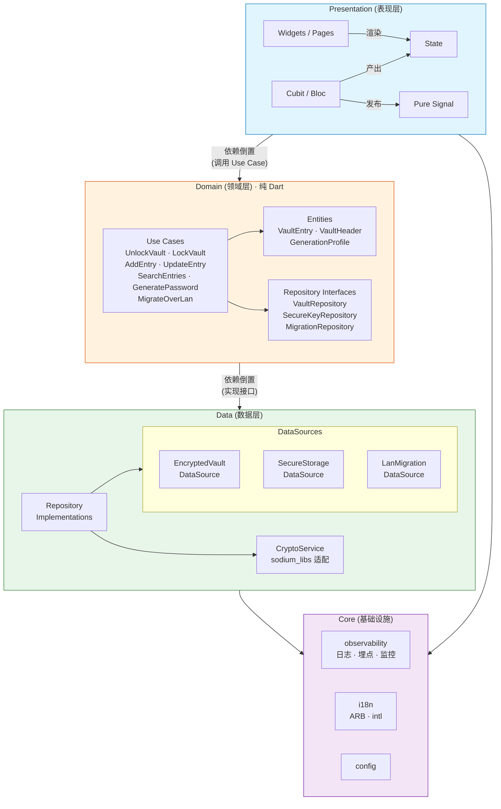
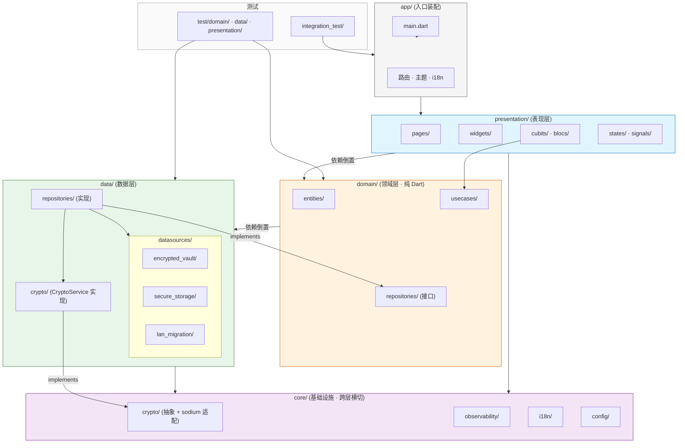
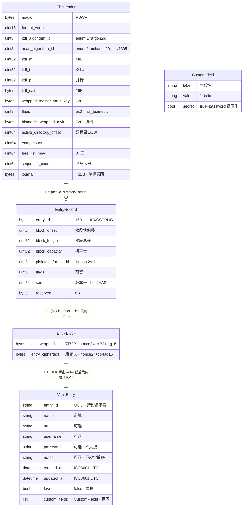

# 架构设计文档 · PROJECT_SW

> 本文档描述 PROJECT_SW 的系统架构。密码学细节以 [SECURITY.md](./SECURITY.md) 为准,本文只引用其结论。

## 1. 设计原则

1. **Clean Architecture** —— 依赖方向单向向内:presentation → domain ← data。内层(domain)不依赖任何外层框架。
2. **本地优先** —— 所有持久化与加解密在设备本地完成,无网络依赖(局域网迁移为唯一例外,且作为独立 data source 隔离)。
3. **可测试性** —— domain 层为纯 Dart,可脱离 Flutter/平台 SDK 单测;data 层通过接口注入便于 mock。
4. **响应式状态** —— 表现层使用 Cubit/Bloc + State + Pure Signal,UI 为状态的纯函数。
5. **加密方案与实现解耦** —— 密码学操作收敛到一个 `CryptoService` 抽象,底层可替换(`sodium_libs` ↔ 纯 Dart),信封架构不绑死具体库。

## 2. 分层结构

```
┌─────────────────────────────────────────────────────────┐
│  Presentation (表现层)                                   │
│  Widgets · Pages · Cubit/Bloc · State · Pure Signal      │
└──────────────────────────┬──────────────────────────────┘
                           │ 依赖倒置(调用 use case)
┌──────────────────────────▼──────────────────────────────┐
│  Domain (领域层)  —— 纯 Dart,无 Flutter/平台依赖          │
│  Entities · Use Cases · Repository Interfaces            │
└──────────────────────────┬──────────────────────────────┘
                           │ 依赖倒置(实现接口)
┌──────────────────────────▼──────────────────────────────┐
│  Data (数据层)                                            │
│  Repository Implementations · DataSources                │
│  ┌──────────────┐ ┌──────────────┐ ┌──────────────────┐ │
│  │ EncryptedVault│ │ SecureStorage │ │ LanMigrationDS  │ │
│  │ DataSource    │ │ DataSource    │ │ (网络/传输)      │ │
│  │ (本地加密库)   │ │ (Keychain/    │ │                 │ │
│  │               │ │  Keystore)    │ │                 │ │
│  └──────────────┘ └──────────────┘ └──────────────────┘ │
└─────────────────────────────────────────────────────────┘
```

### 2.1 Presentation 层
- **Widgets/Pages**:仅负责渲染与事件上报,不持有业务逻辑。
- **Cubit/Bloc**:承接 UI 事件,调用 domain use case,产出 State。
- **State**:不可变值对象,描述某一时刻的界面。
- **Pure Signal**:用于跨组件、跨 Bloc 的细粒度响应式信号(如解锁状态、搜索关键词),避免不必要的重建。

### 2.2 Domain 层
- **Entities**:`VaultEntry`(规格见 §10)、`GenerationProfile`(规格见 §9) 等纯数据模型。`VaultHeader` 对应 SECURITY `File Header`(见 [SECURITY.md §5.3](./SECURITY.md))。
- **Use Cases**:`UnlockVault`、`LockVault`、`AddEntry`、`UpdateEntry`、`SearchEntries`、`GeneratePassword`(规格见 §9)、`MigrateOverLan` 等,封装单一业务用例。
- **Repository Interfaces**:`VaultRepository`、`SecureKeyRepository`、`MigrationRepository` 等抽象,由 data 层实现。

### 2.3 Data 层
- **Repository 实现**:组合多个 DataSource 实现 domain 接口,负责加解密编排。
- **EncryptedVaultDataSource**:负责密码库文件的读写(密文)、序列化格式、版本/头信息管理。序列化已定为**自定义二进制外壳 + JSON 内层**(见 [SECURITY.md §5](./SECURITY.md)),含 free list 与崩溃安全 journal,支持逐条 O(1) 局部更新。
- **SecureStorageDataSource**:封装系统 Keychain/Keystore,存放包裹后的库主密钥(生物解锁路径)。
- **LanMigrationDataSource**:二维码点对点配对 + 直连 TCP 握手与传输,无 multicast/自动发现,独立隔离,仅在迁移功能激活时启用网络栈(见 [SECURITY.md §8.1](./SECURITY.md))。



> 依赖方向:单向向内。Presentation 依赖 Domain(调用 use case);Domain 零 Flutter/平台导入;Data 实现 Domain 接口;Core 为跨层横切。加解密一律经 `CryptoService` 抽象,禁止在 Presentation/Domain 直接调用 libsodium。
>
> **组织演进**:上图展示逻辑分层(横切视图),实际代码按业务线(feature-based)组织——见 [§5 项目结构](#5-项目结构目标)。每条业务线内部复现此分层(如 `features/auth/` 内含 `presentation/`/`domain/`/`data/`),业务线间零直接依赖,跨域共享经 `shared/` 或依赖注入接口。

## 3. 核心模块

| 模块 | 职责 | 关键依赖 |
|------|------|----------|
| `crypto` | KDF(Argon2id)、AEAD(XChaCha20-Poly1305)、信封加解密、随机数 | `sodium_libs` |
| `vault` | 密码库结构、条目 CRUD、密钥层级包裹/解包 | `crypto`, `data` |
| `biometric` | 生物识别授权、硬件密钥释放 | 平台生物识别 API, `SecureStorageDataSource` |
| `migration` | 二维码点对点配对、安全握手、库传输 | 平台网络 + 相机 API |
| `search` | 本地检索(对加密元数据/索引的安全处理) | `vault` |
| `generator` | 密码生成(随机字符串/可发音模式、字符集、强度评估) | 纯 Dart + CSPRNG(sodium `randombytes`,见 [SECURITY.md §15](./SECURITY.md)) |
| `i18n` | 中英文资源加载 | `intl` + ARB |
| `observability` | 日志、埋点、监控(见 DEVELOPMENT.md) | 跨层 hook |
| — | — | — |
| `core/vault_file` | vault 文件外壳格式:File Header + Directory(EntryRecord[]) + Entry Block(双段) + free list + journal 读写(见 SECURITY.md §5) | `core/crypto`(CryptoService) |
| `shared/` | 跨域共享原语:实体(VaultEntry, VaultHeader, GenerationProfile)、值对象(EntryId, CustomField)、领域错误(VaultLockedException, DecryptionFailureException) | 被所有业务线与 core 依赖 |

## 4. 密钥层级与数据流

完整密码学设计见 [SECURITY.md §密钥层级](./SECURITY.md)。架构层面只强调:加解密编排集中在 data 层的 repository,`CryptoService` 为唯一入口,domain 层只处理明文实体,绝不接触密钥或密文。

**解锁数据流**:

```
用户输入主密码 ──Argon2id──▶ KEK(256-bit,仅内存)
                                │ 解密 vault header
                                ▼
                     Master Vault Key(随机 256-bit)
                                │ 解密每条 DEK
                                ▼
                       DEK_i(随机 256-bit)
                                │ XChaCha20-Poly1305 解密
                                ▼
                        明文 VaultEntry(domain 实体)
```

**生物解锁路径**:首次主密码解锁后,Master Vault Key 经硬件密钥包裹存入 Keychain/Keystore;后续生物识别通过后,由 OS 释放该密钥,跳过 Argon2id 派生环节(详见 SECURITY.md)。

## 5. 项目结构(目标)

本项目按**业务线**(feature-based)组织,每条业务线内采用 Clean Architecture 分层。跨域共享原语置于 `shared/`,全层基础设施置于 `core/`。

```
lib/
  main.dart
  app/                              # 应用装配(路由 · 主题 · 依赖注入 · i18n 挂载)

  features/
    auth/                           # 认证业务线
      presentation/{pages,cubits,states}
      domain/{usecases,repositories}
      data/{repos,datasources}      # datasource = Keychain/Keystore

    vault/                          # 密码库业务线
      presentation/{pages,cubits,states}
      domain/{entities,usecases,repositories}
      data/{repos,datasources}      # datasource = vault 文件读写(条目层)

    generator/                      # 密码生成业务线
      presentation/{pages,cubits,states}
      domain/{entities,usecases}
      data/                         # 无持久化或仅读 GenerationProfile 本地配置

    search/                         # 本地搜索业务线
      presentation/{pages,cubits,states}
      domain/{usecases}
                                    # 无独立 data,依赖 vault 内存明文

    migration/                      # 局域网迁移业务线
      presentation/{pages,cubits,states}
      domain/{usecases,repositories}
      data/{datasources}            # datasource = LAN 网络

    settings/                       # 设置业务线
      presentation/{pages,cubits,states}
      domain/{entities,usecases}
      data/{repos,datasources}      # datasource = 本地 app 存储

  core/                             # 基础设施(跨层横切)
    crypto/                         # CryptoService 抽象 + sodium 适配
    vault_file/                     # vault 文件格式(外壳 header/directory/block/free list/journal)
    observability/                  # 日志/埋点/监控/脱敏
    i18n/                           # ARB + intl
    config/                         # 全局配置

  shared/                           # 跨域共享原语
    entities/                       # VaultEntry · VaultHeader · GenerationProfile
    value_objects/                  # EntryId · EntryRecord · CustomField
    errors/                         # VaultLockedException · DecryptionFailureException · ...

test/                               # 单元测试(镜像 features/ + core/ 结构)
  features/
    auth/ vault/ generator/ search/ migration/ settings/
  core/
integration_test/                   # 集成测试
```

**关键设计约束**:

| 约束 | 说明 |
|------|------|
| 业务线间零直接依赖 | `features/auth` 不直接 `import features/vault`;跨域共享经 `shared/` 或依赖注入接口 |
| 业务线内 Clean Architecture | 每条业务线内部保持 `presentation → domain ← data` 单向依赖 |
| core 为纯基础设施 | `core/crypto`、`core/vault_file`、`core/observability` 等不含业务逻辑,被多条业务线依赖 |
| shared 为纯数据 | `shared/entities`、`shared/value_objects` 只含字段定义,不含 use case/业务逻辑 |
| vault 文件外壳归 core | `core/vault_file` 提供 header/directory/block/free list/journal 读写,被 auth(读 header)、vault(读写条目)、migration(批量导入) 共用 |
| 加密全经 CryptoService | 各业务线 domain 层依赖 `core/crypto` 的 `CryptoService` 接口(data 层实现);禁止直接调用 libsodium |

### 5.1 业务线-模块映射

| 旧模块(§3) | 新业务线 | 说明 |
|-----------|---------|------|
| `biometric` + `vault`(解锁/锁定部分) | `features/auth` | 认证业务线吸收生物解锁与锁定流程 |
| `vault`(CRUD 部分) | `features/vault` | 密码库的增删改查 |
| `generator` | `features/generator` | 独立业务线(锁定态可用) |
| `search` | `features/search` | 依赖 vault 业务线提供明文条目(经注入) |
| `migration` | `features/migration` | 依赖 `core/vault_file` 与 `core/crypto` |
| `i18n` + `observability` | `core/i18n` + `core/observability` | 基础设施,非业务线 |
| `crypto` | `core/crypto` + `core/vault_file` | 外壳格式与加解密原语分离为两个 core 模块 |
| — | `shared/` | 新增:跨域实体、值对象、领域错误 |



> 依赖方向:app → presentation → domain ← data。domain 零平台导入,虚线框表示接口(`repositories/`)由 data 实现。core 为全层共享基础设施(加密抽象、日志、i18n、配置)。测试与源文件镜像目录映射。

## 6. 状态管理约定

- 一个业务域一个 Cubit/Bloc,粒度以"页面或功能域"为单位,避免巨型 Bloc。
- State 为不可变类,变更经 `copyWith`。
- 跨 Bloc 共享状态(如全局解锁态、当前搜索词)走 Pure Signal 订阅,避免层层透传。
- 敏感状态(明文密码、密钥)禁止进入全局可观察状态,仅在受控作用域内短生命周期持有。

## 7. 错误与可观测性

- 错误分层:domain 抛领域异常(`VaultLockedException`、`DecryptionFailureException`),presentation 负责映射为用户可见提示。
- 日志/埋点 hook 集中在 `core/observability`,禁止在 domain 层直接打印明文敏感字段(详见 SECURITY.md §内存与日志卫生)。

## 8. 待决与演进

- 局域网迁移协议细节(设备发现、握手认证)—— 见 SECURITY.md §局域网迁移。
- 本地搜索采用**解锁后内存内线性检索**(基线),不建持久化索引(见 [SECURITY.md §9](./SECURITY.md));password 不入可搜集合与结果展示。
- 密码库文件格式已定:**自定义二进制外壳 + JSON 内层**(见 [SECURITY.md §5](./SECURITY.md)),支持逐条 O(1) 局部更新与格式版本迁移。

## 9. 密码生成器规格(已定)

对应核心功能"密码生成"。规格定义 `GenerationProfile` 实体与 `GeneratePassword` use case 的参数空间。

### 9.1 随机源(安全根基)

- 生成器随机源**与加密用 CSPRNG 同源**:使用 `sodium_libs` 的 `randombytes`(经审计,与盐/nonce/MVK/DEK 同源),**禁止**用 `dart:math.Random()`(伪随机)或未审计的第三方随机源(见 [SECURITY.md §15](./SECURITY.md))。
- 抽样采用**无偏等概率**方式(如拒绝采样),避免字符集大小非 2 的幂时的模偏置。

### 9.2 生成模式与字符集

**pronounceable 模式字符集**:默认仅使用字母(辅音+元音交替,基于固定音节表),与 §9.3 `charsets` 的 digits/symbols 开关独立;若需在音节间插入数字/符号,实现期可扩展。

| 模式 | 说明 | 默认 |
|------|------|------|
| **随机字符串**(random) | 从启用的字符集均匀抽取 N 字符 | ✓ 默认模式 |
| **可发音**(pronounceable) | 按音节结构(辅音/元音交替)生成类词字符串,可读性介于随机串与 passphrase 之间 | 可选 |

> 不提供 passphrase(多词拼接)模式:依赖外部词库资产,与最小依赖原则冲突;可发音模式已覆盖"可读性"诉求。

### 9.3 字符集(随机字符串模式)

| 字符集 | 范围 | 默认启用 |
|--------|------|----------|
| 小写字母 | `a-z` | ✓ |
| 大写字母 | `A-Z` | ✓ |
| 数字 | `0-9` | ✓ |
| 符号 | 可配置子集(默认 ASCII 符号集,排除影响表单/URL 的字符如空格、`/`、`"`、`'`) | ✓ |

- **可读性选项(排除易混字符)**:可选排除易混集 `O 0 I 1 l |`(及按需 `B 8`、`S 5`、`G 6` 等),减少人工辨识错误;默认**关闭**(保留熵),用户可开。
- 至少启用一个字符集;若启用集并集为空,生成拒绝。

### 9.4 长度

| 项 | 值 |
|----|----|
| 默认长度 | **20 字符**(全面字符集下理论熵 ≈ 131 bit) |
| 最小长度 | 8 |
| 最大长度 | 128(避免 UI/存储边界问题) |
| 可发音模式长度 | 按音节数控制,默认映射到等价熵 |

### 9.5 强度评估(口径已定)

- 采用**理论熵估算**:`entropy ≈ length × log2(启用字符集并集大小)`,映射到标签:
  - `< 50 bit`:弱
  - `50–80 bit`:中
  - `80–120 bit`:强
  - `> 120 bit`:极强
- **不引入字典/模式评估**(如 zxcvbn):避免重依赖与词库,与最小依赖原则一致。代价:不识别弱模式(如重复/键盘序列)——以"随机源无偏 + 用户可调长度"兜底,UI 提示理论熵为估算值。
- 可发音模式按音节熵折算:`entropy ≈ syllable_count × log2(音节表大小)`,音节表为固定辅音×元音组合集合;折算后套用同一标签阈值(§9.5)。
- **pronounceable 模式字符集**:默认仅使用字母(辅音+元音,约 26 个大写/小写字符的固定音节表);`charsets` 中的 digits/symbols 开关在 pronounceable 模式下**是否生效待定**,默认关闭(纯字母发音串)。若需在音节间插入数字/符号,实现期可扩展。

### 9.6 GenerationProfile 实体字段(目标)

```dart
GenerationProfile {
  mode: { random | pronounceable }       // 默认 random
  length: int                             // 默认 20,范围 [8, 128]
  charsets: { lowercase, uppercase, digits, symbols }  // 各 bool,默认全 true
  excludeAmbiguous: bool                  // 默认 false
  symbolSubset: Set<String>               // 可配置符号子集
}
```

`GeneratePassword(profile) → String` 为纯函数(domain 层),随机源经抽象注入便于单测(测试注入固定随机源以可复现)。**生成器输出流向**:生成器输出经用户确认后填入 VaultEntry.password 或 custom_fields.value(§10),随条目走 §5 信封加密;输出未存入 vault 前为短暂 UI 态,按 §7 内存卫生持有与清零。**生成器可在锁定态独立使用**(不依赖 vault/MVK),此时输出复制应同样走 §7.1 剪贴板 20s 清除。

## 10. VaultEntry 字段规格(已定)

`VaultEntry` 为条目明文实体(domain 层,经 DEK 加密后存入 `entry_ciphertext`,见 [SECURITY.md §5](./SECURITY.md))。项目定位为**纯密码管理器**,不含 TOTP/2FA。

### 10.1 固定字段

| 字段 | 类型 | 必填 | 可搜(SECURITY §9) | 说明 |
|------|------|------|----------|------|
| `entry_id` | UUID/CSPRNG(16B) | ✓ | — | 条目身份,跨设备不变;外壳 EntryRecord 持有,明文实体亦暴露 |
| `name` | String | ✓ | ✓ | 条目标识(如 "GitHub") |
| `url` | String | ✗ | ✓ | 服务地址 |
| `username` | String | ✗ | ✓ | 登录账号 |
| `password` | String | ✗ | **✗** | 密码;**不入可搜与列表展示**,仅详情页解密展示(SECURITY §9) |
| `notes` | String | ✗ | 可选 | 备注;可搜,故**不应填敏感信息** |
| `created_at` | ISO8601 UTC | ✓ | — | 创建时间 |
| `updated_at` | ISO8601 UTC | ✓ | — | 最近更新;用于排序与迁移冲突判新(SECURITY §8.1) |
| `custom_fields` | List<CustomField> | ✗ | 见下 | 自定义键值,见 §10.2 |
| `favorite` | bool | ✗ | ✓ | 收藏标记;true 时置顶展示(条目组织仅此一种,见 §10.5) |

> `password` 可选:支持纯 note 条目或仅有 username 的条目。`name` 为唯一必填业务字段。

### 10.2 自定义字段(CustomField)

```dart
CustomField {
  label: String        // 字段名(如 "安全问题"、"备用邮箱"、"PIN")
  value: String        // 字段值
  secret: bool         // true = 敏感字段,按 password 级卫生处理
}
```

- **`secret: true` 的自定义字段**:与 `password` 同级卫生——**不入可搜集合、不入列表展示**,仅条目详情页按需解密展示(对齐 [SECURITY.md §9](./SECURITY.md))。
- **`secret: false` 的自定义字段**:非敏感,可入可搜(按 label/value 匹配)、可入列表展示。
- 存在意义:让用户区分敏感与非敏感附加信息,避免把敏感内容塞进 `notes`(notes 可搜,会意外暴露,见 [SECURITY.md §9](./SECURITY.md))。

### 10.3 字段卫生汇总(对接 [SECURITY.md §9](./SECURITY.md) 搜索)

| 字段类别 | 入可搜 | 入列表展示 | 详情页展示 |
|----------|--------|-----------|-----------|
| name / url / username | ✓ | ✓ | ✓ |
| notes | 可选 | 可选(截断) | ✓ |
| password | ✗ | ✗ | ✓(按需解密) |
| custom_fields(secret=true) | ✗ | ✗ | ✓(按需解密) |
| custom_fields(secret=false) | ✓ | ✓ | ✓ |
| favorite | ✓ | ✓(置顶) | ✓ |

### 10.4 序列化(内层)

VaultEntry 明文经 SECURITY §5.1 内层 JSON 序列化为裸字节后喂入 AEAD;`entry_id`/`seq` 由外壳 EntryRecord 持有(SECURITY §5.3),内层 JSON 可选择是否冗余 `entry_id`(便于解码后校验一致性)。**字段级演进策略**:JSON 解析采用宽容模式(忽略未知字段,缺失字段取类型默认值——`favorite` 缺省为 `false`、`created_at`/`updated_at` 缺省为 epoch 等),新字段经应用升级自然生效,无需批量迁移;`plaintext_format_id` 只派发格式级(JSON→CBOR),不派发字段版本,字段演进依赖宽容解析而非格式版本号。

### 10.5 条目组织(已定)

项目仅提供**收藏(flag)**一种条目组织维度,不做分类/文件夹/标签/嵌套树:

- `favorite: bool` 标记常用条目,列表页置顶展示;非敏感字段,可搜、可展示。
- **不做更重组织的原因**:个人库规模(几十~数百条)下,搜索(SECURITY §9)已能快速定位,分类/标签边际价值低;标签(多对多)与嵌套文件夹(树)会增实体与迁移复杂度(SECURITY §8.1 需迁组织结构),与"个人玩具 + 先简化"基调冲突。
- **演进预留**:未来若库变大、组织需求显现,可评估加单层 `category` 或 `tags`——`favorite` 字段不影响此演进。



> **关系说明**:
> `FileHeader`(`active_directory_offset`)→指向当前活跃 Directory→`EntryRecord[]`;
> `EntryRecord`(`block_offset`)→指向 `EntryBlock`(双段:前 72B `dek_wrapped` + 后变长 `entry_ciphertext`);
> `EntryBlock`→经 DEK 解密→`VaultEntry` 明文(内层 JSON)。`VaultEntry` 仅在解锁后内存存在,落盘即为 `entry_ciphertext` 密文。
