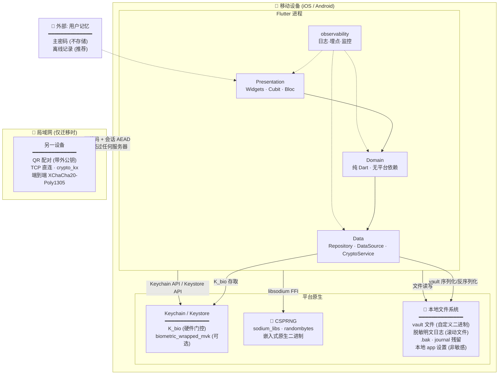
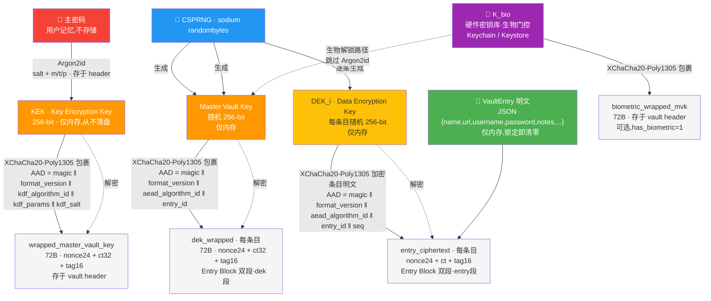
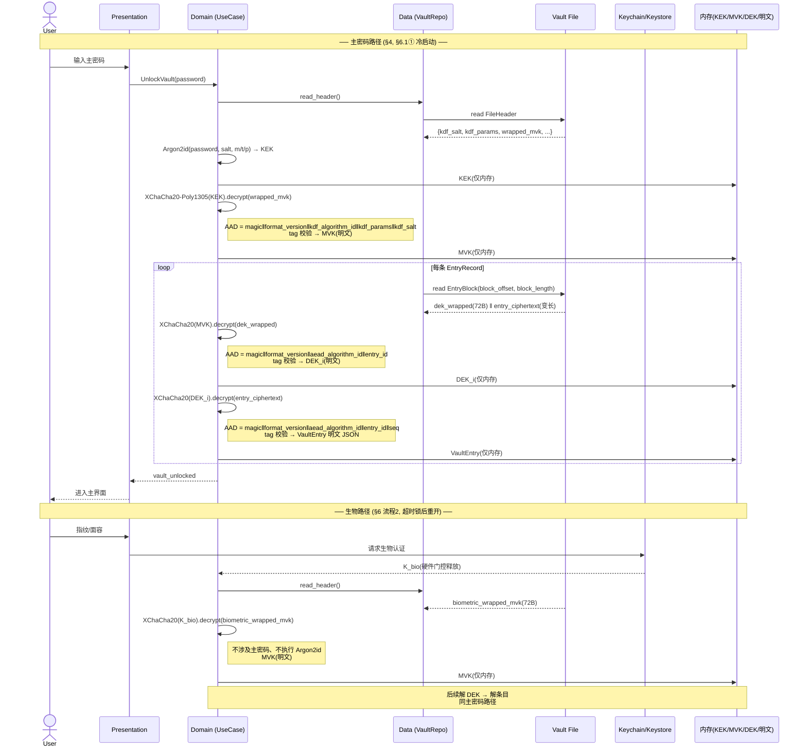
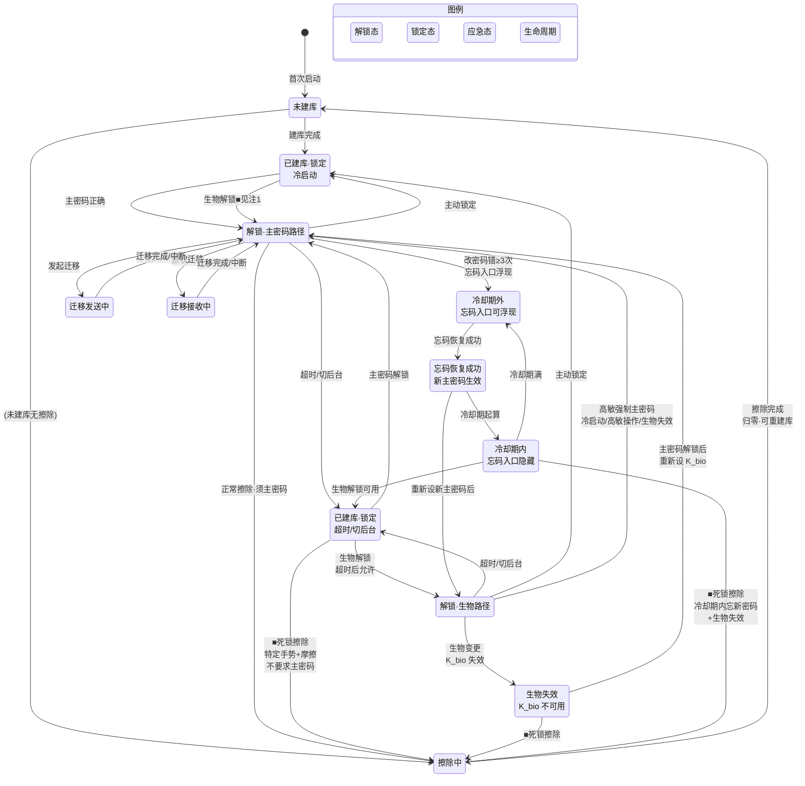

# 安全设计文档 · PROJECT_SW

> 本文档定义 PROJECT_SW 的威胁模型、加密方案、密钥层级与各项功能的安全实现要求。
> 它是项目安全设计的**权威来源**;架构与开发文档以本文为准。

## 1. 设计目标与信任边界

- **目标**:在设备本地完成所有加解密;即使本地密码库文件被窃取,在不知道主密码的前提下,攻击者无法离线还原明文。
- **信任边界**:设备本身(含其硬件密钥库)是唯一信任域。无任何后端、无云、无第三方托管。局域网迁移为受控的、临时性的跨边界通道。



> **节点说明**:
> - **Flutter 进程**:所有业务逻辑在设备本地完成,无网络依赖(迁移除外)。
> - **平台原生**:`sodium_libs` 为嵌入式原生二进制(嵌入式,非外部服务);`Keychain/Keystore` 由 OS 管,`K_bio` 可选设生物门控;vault 文件与日志均在本地文件系统。
> - **LAN 通道**:唯一跨信任边界数据流,经 QR 带外公钥 + `crypto_kx` 端到端加密,纯 P2P 无中转(§8 第 5 项)。
> - **用户记忆**:主密码是唯一不由系统存储的秘密(零知识),离线记录为推荐的缓解措施(§10.2)。
- **不保证**:设备已被 root/越狱、或恶意软件已拿到运行时内存时的绝对安全(此类场景超出本地应用可防御范围,见 §威胁模型)。

## 2. 加密方案(已定)

| 维度 | 选定 | 说明 |
|------|------|------|
| KDF | **Argon2id** | OWASP 2024 默认推荐,抗 GPU/ASIC |
| AEAD | **XChaCha20-Poly1305** | 192-bit nonce,随机 nonce 即安全,恒定时间 |
| 加密粒度 | **逐条信封加密(envelope)** | 每条目独立 DEK,支持局部更新与元数据加密 |
| 密码学库 | **`sodium_libs`**(libsodium 绑定) | 经广泛审计,全平台嵌入式二进制 |
| 密钥安全存储 | 系统 Keychain/Keystore(硬件背书) | 生物解锁路径使用 |

**选型理由摘要**:XChaCha20 的 24 字节 nonce 让随机 nonce 即可安全使用,几乎消除 nonce 重用风险——对缺乏专职安全审查的个人项目是关键降险。逐条信封加密与生物解锁、局域网迁移、本地搜索三大功能在架构上天然契合。完整选型对比与论证见会话记录(方案 A/B/C/D 对比)。

## 3. Argon2id 参数(起始值)

| 参数 | 起始值 | 说明 |
|------|--------|------|
| 内存 `m` | **64 MiB**(65536 KiB) | OWASP 现代档;低端 Android 可自适应下调至 19–46 MiB |
| 迭代 `t` | **3** | 与 m=64MiB 配合,目标派生耗时 250–400ms |
| 并行 `p` | **1** | 移动端核心有限,p=1 更稳定;多核设备可 p=2 |
| 盐长度 | **16 字节** | 每库唯一,CSPRNG 生成 |
| 派生输出 | **32 字节**(256-bit) | 匹配 AEAD 密钥长度 |
| 自适应 | **是** | **首次建库时**(即第一次派生 KEK 前)在目标设备跑基准,在 ≤设定延迟(默认 1s)内选取最高档参数并持久化到 vault header |

参数与派生算法版本一并写入 vault header,支持未来无痛升级(见 §密钥与参数演进)。

## 4. 密钥层级

```
主密码(用户记忆,不存储)
   │  Argon2id(盐 + 参数,存于 vault header)
   ▼
KEK(Key Encryption Key,256-bit)─── 仅内存,从不落盘
   │  XChaCha20-Poly1305 包裹
   ▼
Master Vault Key(随机 256-bit)─── 密文存于 vault header
   │  XChaCha20-Poly1305 包裹每条
   ▼
DEK_i(Data Encryption Key,每条目随机 256-bit)─── 密文(dek_wrapped)随条目 Entry Block 存储(§5.3 双段)
   │  XChaCha20-Poly1305 加密条目明文
   ▼
密文 VaultEntry_i
```



- **KEK**:由主密码派生,只存在于解锁后的内存;锁定/退出即清零。
- **Master Vault Key**:随机生成,是"换主密码不改密文"的关键——改主密码只需用新 KEK 重新包裹 Master Vault Key,无需重加密所有条目。
- **DEK**:每条目独立随机密钥,实现局部更新(改一条只重写该条 + 其 DEK 密文)、单条迁移、单条销毁。

### 4.1 解锁序列(主密码路径 + 生物路径)



## 5. 数据布局(密码库文件)

密码库为单个本地文件。序列化格式**已定**(见 §5.1–§5.6):**自定义二进制外壳 + JSON 内层条目明文**,支持逐条 O(1) 局部更新与格式版本迁移。

### 5.1 两层序列化(已定)

序列化横跨两层,各自独立选型:

| 层 | 对象 | 是否密文 | 选型 |
|----|------|----------|------|
| **外壳层** | 整个 vault 文件(header + 目录 + 条目块) | 大部分已是密文 blob | **自定义二进制** |
| **内层** | 单条目明文 `{name,url,username,password,notes}`(加密前输入,字段规格见 [ARCHITECTURE.md §9](./ARCHITECTURE.md)) | 明文,加密后变 blob | **JSON**(`plaintext_format_id` 逐条标识) |

- 外壳把 `entry_ciphertext` 视为**不透明 blob**(nonce24 + ct + tag),不解析其内部;内层选型不进入外壳布局。
- 内层明文直接喂给 AEAD 为裸字节,不经过 base64;JSON 体积开销仅为语法开销(引号/键名/分隔符),对数十~数百字节条目可忽略。
- 内层经 `plaintext_format_id` 前缀式派发,未来可逐条迁至 CBOR,无需批量重加密(与 §12 一致)。

### 5.2 外壳文件布局

```
┌─ File Header(定长)
├─ Directory(EntryRecord[] 定长,如每条 48B)
└─ Entry Block Region(变长槽:nonce24+ct+tag,外壳视为不透明)
     ├─ 活跃槽 ─┬─ 空闲槽(free list 节点)─┬─ 活跃槽 ─┤
```

三个区域:**定长 header + 定长目录记录 + 变长条目块**。改一条只动「该条目块 + 目录中该条 48B 记录」,header 与其余条目不碰,实现逐条 O(1) 更新(对齐 §4 局部更新目标与 §8 单条迁移)。

### 5.3 外壳字段规范

**File Header(定长,偏移示意)**

| 偏移 | 长度 | 字段 | 说明 |
|------|------|------|------|
| 0 | 4 | magic `PSWV` | 文件识别 |
| 4 | 2 | `format_version` | **外壳版本**,前缀式派发入口(§12) |
| 6 | 1 | `kdf_algorithm_id` | enum:1=argon2id |
| 7 | 1 | `aead_algorithm_id` | enum:1=xchacha20-poly1305 |
| 8 | 12 | `kdf_params{m,t,p}` | uint32×3(§3) |
| 20 | 16 | `kdf_salt` | §3 |
| 36 | 72 | `wrapped_master_vault_key` | nonce24+ct32+tag16,被 KEK 包裹 |
| 108 | 1 | `flags` | bit0=has_biometric |
| 109 | 72 | `biometric_wrapped_mvk`(=`biometric_wrapped_master_vault_key`,§6) | 同形,被硬件密钥包裹(可选,见 §6) |
| … | 8 | `active_directory_offset` | 指向当前活跃目录;支持双目录/COW——批量操作可写新目录到空闲区后原子切换此指针(见 §5.4、§8.1 原子性) |
| … | 8 | `entry_count` | 活跃条目数 |
| … | 8 | `free_list_head` | 首个空闲槽偏移,0=无 |
| … | 8 | `sequence_counter` | 全局序号,供 AAD/重放防护 |
| … | ~32 | `journal` 槽 | 单槽意图日志,崩溃安全(见 §5.4) |
| … | — | reserved(零填充至定长) | 预留未来字段 |

**Directory EntryRecord(定长 48B,每条目一份)**

| 偏移 | 长度 | 字段 | 说明 |
|------|------|------|------|
| 0 | 16 | `entry_id` | UUID/CSPRNG |
| 16 | 8 | `block_offset` | 条目块在文件中的偏移 |
| 24 | 4 | `block_length` | 实际密文长度 |
| 28 | 4 | `block_capacity` | 槽容量(≥ length,用于就地改写判断) |
| 32 | 1 | `plaintext_format_id` | 内层前缀派发:1=json,2=cbor |
| 33 | 1 | `flags` | 预留 |
| 34 | 8 | `seq` | 该条版本号,绑入 AAD |
| 42 | 6 | reserved | — |

**Entry Block(双段,外壳不透明)**:`dek_wrapped(定长 72B: nonce24 + ct32 + tag16) ‖ entry_ciphertext(变长: nonce24 + ct(|明文|) + tag16)`。外壳只认 `block_length` / `block_capacity`(覆盖双段总长),不解析内部;**前 72B 约定为 dek 段**(dek 明文恒 256-bit=32B,故 dek_wrapped 定长 72B),其余为 entry 段。
- **dek 段定长的意义**:改 DEK 时(dek_wrapped 重包裹)可**原地覆写前 72B**,entry 段与 block 偏移不动——改 DEK 的 O(1) 由此实现,且不触发 free list 重分配。
- dek_wrapped 由 MVK 包裹(§5.5 第三行),entry_ciphertext 由 DEK 加密(§5.5 第一行),两段各自独立 AEAD。

### 5.4 free list 与崩溃安全

- **free list**:空闲槽自链(`next_free_offset(8B) + capacity(4B) + ...`),header 的 `free_list_head` 指向首节点。分配取 `capacity ≥ 需求` 的槽(可分裂),否则 append 到 EOF;释放将旧槽 push 到链头。碎片由周期性 compaction(锁定时空闲时整体重写,O(N) 离线维护,非热路径)回收。
- **崩溃安全 journal**:header 内单槽意图日志,覆盖两类中途崩溃:
  - **单条更新**(新增/改/删):`journal{op, entry_id, new_offset, new_length, seq, checksum}`,完成块+目录写入后清零;打开时非空且校验通过 → 重放或回滚,校验失败 → 判损坏/回退 .bak。
  - **目录切换**(批量导入/compaction 等多记录原子操作,§8.1 C4):`journal{op=DIR_SWITCH, new_directory_offset, checksum}`,新目录与块就位后写此 journal,原子切换 `active_directory_offset` 后清零;打开时非空且校验通过 → 切换至新目录(完成提交)或回滚(保持旧目录),校验失败 → 回退 .bak。

> 单槽 journal 经"目录切换"单步意图即可支撑批量原子提交:多记录操作先把所有块与新目录写好(可多次普通写,中途崩溃不影响旧 active 目录),最后以单步 journal 记录"切换"动作,从而把 N 条原子性收敛为 1 步原子切换。完整多步 WAL 对个人库仍为过度设计,不引入。

> O(1) 就地改写排除了「整文件原子重命名」式简单兜底(其每次保存为 O(N),与逐条 O(1) 决策冲突),故采用单槽 journal。完整多步 WAL 对个人库为过度设计,不引入。

### 5.5 AAD 绑定(已定)

AEAD 操作将身份与版本绑入认证数据,Poly1305 校验从「这条密文未被改」升级为「这条密文属于该 entry_id/版本/算法」,对应 §11 篡改威胁与 §12 前缀派发:

| AEAD 操作 | 绑定 AAD |
|-----------|----------|
| DEK 加密条目明文 | `magic ‖ format_version ‖ aead_algorithm_id ‖ entry_id ‖ seq` |
| MVK 包裹 DEK | `magic ‖ format_version ‖ aead_algorithm_id ‖ entry_id` |
| KEK 包裹 MVK | `magic ‖ format_version ‖ kdf_algorithm_id ‖ kdf_params ‖ kdf_salt` |

> 三层包裹(§4)逐层绑 AAD:`DEK 加密明文`绑 `seq`(防条目版本回放)、`MVK 包裹 DEK`绑 `entry_id`(防 DEK 在条目间互换的混淆篡改)、`KEK 包裹 MVK`绑 KDF 参数(防参数降级)。`MVK 包裹 DEK` 不绑 `seq`:DEK 的包裹关系随条目版本变化由"换 DEK"体现,包裹本身无需 seq 认证。

### 5.6 更新语义(O(1))

Entry Block 为 dek 段(定长 72B)+ entry 段(变长)双段(§5.3)。按"改明文"与"改 DEK"区分:

| 操作 | 动作 | 写入量 |
|------|------|--------|
| 新增 | 分配槽(free list 或 EOF)→ 写双段块 → 追加 EntryRecord → `entry_count++` | 1 块(72B+entry) + 48B |
| 改明文(新 entry_ciphertext ≤ capacity) | 生成新 DEK → 重包裹 dek_wrapped(原地覆写 dek 段 72B)→ 重加密明文覆写 entry 段 → seq 递增 + 更新 EntryRecord(length, seq, format) | 双段原地 + 48B |
| 改明文(新 entry_ciphertext > capacity) | 生成新 DEK → 分配新槽写双段块 → 旧槽入 free list → 更新 EntryRecord(offset,length,capacity,seq) | 1 块 + 48B(+旧槽标记) |
| 仅改 DEK(如密钥轮换,明文不变) | 重包裹 dek_wrapped → 原地覆写 dek 段 72B → seq 递增 + 更新 EntryRecord(seq) | 72B + 48B(entry 段不动) |
| 删一条 | 块入 free list → 置空/标记该 EntryRecord → `entry_count--` | 48B(+链头) |

> 改明文必然伴随换 DEK(§5.5 注:"DEK 的包裹关系随条目版本变化由换 DEK 体现"),故"改明文"两行均含 dek 段重包裹。"仅改 DEK"为密钥轮换等场景预留,entry 段纹丝不动。seq 递增从 header `sequence_counter` 取新值并回写。

### 5.7 不变约束(保留)

- 每次加密均使用**全新随机 24 字节 nonce**(CSPRNG)。
- Poly1305 标签 16 字节,解密时强制校验,失败即判篡改/损坏。
- 条目明文中的元数据(name/url)同样进入 `entry_ciphertext`,不单独明文暴露。

## 6. 生物解锁

**核心原则:生物特征不直接解密任何东西;它只是授权操作系统释放一个硬件保护的密钥。**

流程:
1. **首次设置**:用户输入主密码 → 派生 KEK → 解出 Master Vault Key → 用一个**硬件密钥库生成的、生物识别门控的密钥 `K_bio`** 包裹 Master Vault Key,得到 `biometric_wrapped_master_vault_key`,存入 vault header(同时 `K_bio` 受系统 Keychain/Keystore 管理,`setUserAuthenticationRequired` / `biometryCurrentSet`)。
2. **生物解锁**:用户通过指纹/面容 → OS(硬件)释放 `K_bio` → 解开 `biometric_wrapped_master_vault_key` → 得到 Master Vault Key → 解 DEK → 访问条目。**全程不涉及主密码、不执行 Argon2id。**
3. **主密码路径始终保留**:主密码 → KEK → 解 `wrapped_master_vault_key`,作为生物失效(换指纹/重置)时的兜底。
4. **生物变更检测**:`K_bio` 绑定当前生物特征集(`biometryCurrentSet` / 等效机制),系统生物特征变更后 `K_bio` 失效,自动回退到主密码路径并提示重新设置生物解锁。

> 注意:生物解锁路径等价于"知道主密码"的便捷替代,其安全强度取决于设备生物识别与硬件密钥库的可靠性,而非密码学本身。文档与 UI 须如实告知用户。

### 6.1 认证强度策略(已定)

生物解锁为便捷默认,主密码路径为强度退路与高敏强制项:

- **便捷档(默认)**:生物识别通过即可解锁,跳过 Argon2id(§6 流程 2);**超时锁定(空闲/切后台)触发后,重新解锁仍允许生物**(保留日常便捷性)。
- **强制主密码档**:以下场景须走主密码路径(KEK → 解 MVK),生物不可替代:
  - ① **应用冷启动 / 进程重启后首次解锁**(防进程被重启后仅凭生物重开);
  - ② **高敏操作**(见下);
  - ③ **生物失效**(§6 流程 3/4,换指纹/重置/变更检测触发)。
- **高敏操作枚举**(生物不可替代,须当时主密码):
  - 修改/删除生物解锁设置本身(防他人用已注册生物偷开后门);
  - **修改主密码**(重新包裹 MVK,防生物冒用后改密码接管全库)——分两路径:① **常规改密码**须当时主密码(本条规则);② **忘码恢复**为隐式应急通道,生物协助,带门槛与冷却,见 §10.2;
  - **导出 / 擦除密码库**(数据离开受控作用域,防生物冒用后清走或拷走全库)——分两路径:① **正常擦除**(解锁态,主动管理数据)须当时主密码(本条规则);② **死锁擦除**(锁定态,主密码与生物均不可用时逃生)为隐式应急通道,不要求主密码,带摩擦,见 §10.2;
  - 发起 / 接收局域网迁移(跨设备数据流动,防生物冒用后把条目迁到他人设备)。
- **用户可配置开关**:用户可选择全局禁用生物解锁,始终走主密码(对应 §11「可配置打开需主密码」)。
- **风险立场(显式)**:项目接受生物特征可被冒用的残余风险(强度归 OS/硬件,见 §6 末注),以「主密码兜底 + 高敏强制 + 用户可禁用」为退路,不承诺生物路径的绝对强度。
- **UI 告知**:设置生物解锁与每次强制主密码时,均须如实告知强度边界与触发原因(对齐 §6 末注)。

## 7. 内存与日志卫生

- 明文密码、KEK、Master Vault Key、DEK 仅在受控作用域内短生命周期持有。
- 尽可能对敏感缓冲区请求 OS 禁止换出(`mlock` 等效;Flutter 侧通过 libsodium 的安全内存 API 与及时清零),使用后立即清零。
- 应用切后台、锁定、超时自动清零内存中的明文与密钥。
- **日志/埋点严禁输出明文敏感字段**;对密码、密钥、条目内容一律脱敏(只可记录条目 id、操作类型、耗时、错误码等非敏感元数据)。
- 剪贴板写入敏感字段须设超时自动清除,并提示用户(详见 §7.1)。

### 7.1 剪贴板卫生(已定)

对应 §7 剪贴板条目与 §11「剪贴板泄漏」威胁行。

**当前版本:清除超时固定(简化),应用设置中可查看;未来版本开放可配置(已预留,与 §10.1 风格一致)。**

| 行为 | 当前固定值 | 未来可选档位(预留) |
|------|-----------|-------------------|
| **剪贴板自动清除超时** | **20 秒** | 10 / 20 / 30 / 60 秒 |

- **覆盖范围**:`password` 与 `custom_fields(secret=true)`(见 [ARCHITECTURE.md §10](./ARCHITECTURE.md))复用同一剪贴板路径与同一清除超时;生成器直接输出(锁定态或解锁态)复制同样走此超时路径。复制非敏感字段(如 username)不触发超时清除(短按需复制即可)。
- **倒计时提示**:复制敏感字段时 toast 显示"已复制,N 秒后自动清除"并倒计时;清除时短提示"剪贴板已清"。知情度优先,避免用户误以为剪贴板仍持密码。
- **iOS 通用剪贴板(Handoff)**:复制敏感字段时设 `localOnly`(iOS `UIPasteboard.options.localOnly = true` 等效),**禁用跨设备 Handoff 同步**——防止 password 经通用剪贴板传播到用户其他 Apple 设备,扩大泄露面(§7 卫生延伸)。
- **与超时锁定正交**:剪贴板是 OS 级,应用锁定(§10.1)不清零剪贴板;剪贴板清除超时独立计时。复制 password → 切走粘贴(此时 §10.1 切后台锁触发,但剪贴板内容仍在)→ 粘贴可行 → 剪贴板按本节超时清除。两者不冲突。**移动平台限制**:iOS/Android 应用退后台后进程可能被挂起,应用内 `Timer` 不保证按秒执行;清除至迟于应用回前台时执行或以 OS 级剪贴板过期选项兜底。
- **设置可见性**:当前固定值须在应用设置中展示(只读),并标注"未来版本可配置"(与 §10.1 一致)。

## 8. 局域网迁移(安全要求)

迁移是唯一跨设备的数据流动,要求:

1. **设备发现与认证**:双方须显式配对确认(如二维码/数字比对),防中间人。
2. **传输加密**:基于配对派生的临时会话密钥(NaCl `crypto_kx` / X25519 + XChaCha20-Poly1305)端到端加密,即便同 LAN 存在窃听者也无法解密。
3. **完整性**:传输整体 MAC 校验,防篡改。
4. **最小化**:可选择全库或单条迁移;逐条信封架构使单条迁移天然可行(发送端解包 DEK 后,传该条 entry_ciphertext + DEK 明文(会话加密),由对端 Master Vault Key 重包裹,见 §8.1)。
5. **无云中转**:纯 P2P,数据不经任何第三方。
6. **迁移后建议**:目标端导入后,源端可选删除(用户确认),并提示更新相关条目。

### 8.1 已定的握手协议约束

下列握手细节已定(迁移握手协议在设计层面闭合;实现期细节如二维码载荷编码、消息类型见编码阶段):

- **设备发现与配对认证(已定 · 方案 C 二维码全通道)**:无 mDNS/自动发现。发起方生成二维码,编码 `{role, IP:port, pk_发起}`;接收方扫码即获得连接信息与发起方公钥(经视觉带外传递,中间人无法在网络层替换)。接收方直连 `IP:port`,在通道内回送自身公钥;双方以 `crypto_kx` 派生会话密钥。发起方公钥带外 → 防中间人冒充发起方;接收方公钥经通道传递,若被替换则双方派生密钥不一致,AEAD 解密失败可检出——**无静默中间人**。选用理由:规避 mDNS 在 iOS multicast entitlement / 企业网 / AP 隔离下的脆弱性(§8 第 5 项禁云中转,发现失败即迁移失败、无兜底),并少一项 mDNS 依赖(对齐 DEVELOPMENT.md §10 最小依赖与 §11 依赖漏洞威胁)。
- **密钥协商**:双方各生成一次性 X25519 临时密钥对(不持久化、不复用),NaCl `crypto_kx` 派生双向会话密钥;公钥经上述二维码配对带外绑定,防 MITM。
- **版本/算法匹配检测(约束兼容)**:迁移传输前,双方须在已建立的加密通道内交换并比对 `format_version`、`aead_algorithm_id` 及**双方支持的 `plaintext_format_id` 取值范围**,**一致方可进入传输**;不一致则拒绝迁移并提示用户先升级至同一版本/算法/内层格式。此约束源于 §5.5 的 entry_ciphertext AAD 取发送端 header 值,接收端须以同值重建 AAD;`plaintext_format_id` 支持集不一致可能导致接收端无法解析某些条目的内层明文(如发送端有 cbor 条目,接收端仅支持 json),故一并纳入兼容性检测。
- **重包裹(发送端解包 → 接收端重包裹)**:
  - **发送端**:用自身 MVK 解包 dek_wrapped 得 **DEK 明文**;经会话 AEAD 加密传输 `{entry_id, seq, plaintext_format_id, entry_ciphertext, DEK 明文}`(DEK 明文走会话加密,不裸传;**不传 dek_wrapped 原文**,因接收端无发送端 MVK 无法解开)。
  - **接收端**:用自身 MVK 重包裹 DEK 明文 → 新 dek_wrapped(AAD = 接收端 header 值 + 迁入 entry_id,见 §5.5 中间行);`entry_ciphertext` 原样写入新 Entry Block 的 entry 段(§5.3 双段),不重加密。
  - **seq 透传(C1)**:接收端 EntryRecord.`seq` **取发送端原值**(因 entry_ciphertext 的 AAD 含发送端 seq,§5.5),**不从自身 sequence_counter 重新分配**;否则 AAD 重建失败、迁入条目无法解密。该 seq 此后随接收端对该条的修改正常递增。
- **完整性**:每消息 AEAD tag + 会话级 transcript MAC(运行中 `H.update(session_seq ‖ ct ‖ tag)`,TRANSFER_END 时校验),防丢包/乱序/重放。
- **原子性(目录双写原子切换,C4)**:接收端先在内存缓冲全部迁入条目,transcript MAC 校验通过后,将所有新 Entry Block(双段)与新 Directory 写入文件空闲区,**就位后原子切换 `active_directory_offset` 指向新目录**(§5.3);切换前崩溃则 active 仍指旧目录,整体回滚(零落盘至活跃库)。journal 仅记"目录切换"单步意图(§5.4)。MAC 失败则丢弃缓冲,不进入提交。此机制兑现批量导入的真原子性,弥补单槽单条 journal 无法支撑 N 条原子提交的限制。
- **entry_id 冲突策略(C2,整条覆盖)**:迁入条目与接收端已有条目 `entry_id` 冲突时,按 `updated_at` 判定——**较新者整条覆盖、丢弃较旧者**(不保留旧 `created_at`,迁入条 created_at 即为最终值),较旧则跳过;冲突均须向用户提示。整条覆盖维持 `entry_ciphertext` 原样透传不重加密(created_at 在加密 blob 内部,字段级合并须重加密,与透传原则冲突,故不合并)。覆盖含所有 VaultEntry 字段(含 `favorite`/`custom_fields`/注释等),非字段级合并。`entry_id` 全局唯一(CSPRNG UUID),正常迁移不应冲突,此策略为兜底。
- **前置约束与超时抑制**:接收端须已建库且处于解锁态(持有自身 MVK);全新设备需先建空库再接收迁移。全库迁移为逐条重包裹的循环,仅数量差异。**迁移进行中临时抑制空闲超时与切后台锁**(恢复暂停计时,迁移完成/中断后恢复);迁移发起前强告知用户"迁移期间请保持应用前台"。
- **生物设置不迁移**:`K_bio` 绑定本设备硬件密钥库(§6),`biometric_wrapped_mvk` 不随迁移传输;接收端须迁移完成后独立设置生物解锁。

```mermaid
sequenceDiagram
    actor UserA as 用户(发送端)
    actor UserB as 用户(接收端)
    participant Send as 发送端(Domain+Vault)
    participant Net as 加密通道(crypto_kx)
    participant Recv as 接收端(Vault+内存缓冲)
    participant RecvV as 接收端 Vault 文件

    Note over UserA,RecvV: ── ① 设备发现与配对认证(§8.1) ──
    UserA->>Send: 发起迁移
    Send->>Send: 生成一次性 X25519 密钥对(pk_发,sk_发)
    Send->>UserA: 显示二维码{role, IP:port, pk_发}
    UserB->>Recv: 扫码 → 获 pk_发(带外,防 MITM)
    Recv->>Recv: 生成一次性 X25519 密钥对(pk_收,sk_收)
    Recv->>Net: TCP 直连,回送 pk_收

    Note over Send,Net: ── ② 密钥协商 ──
    Send->>Send: crypto_kx(pk_收,sk_发) → 会话密钥
    Recv->>Recv: crypto_kx(pk_发,sk_收) → 会话密钥

    Note over Send,Net: ── ③ 版本/算法匹配检测(§8.1) ──
    Send->>Net: {format_version, aead_algorithm_id, plaintext_format_id 支持集}
    Recv->>Net: 比对自身 → 一致 ✓

    Note over Send,RecvV: ── ④ 逐条传输 + 重包裹(§8.1 C1/C3) ──
    loop 每条条目
        Send->>Send: MVK 解包 dek_wrapped → DEK 明文
        Send->>Net: 会话 AEAD 加密: {entry_id, seq(原值), plaintext_format_id, entry_ciphertext(原样), DEK 明文}
        Recv->>Recv: 内存缓冲; 会话 AEAD 解密得各字段
        Recv->>Recv: 自身 MVK 重包裹 DEK 明文 → 新 dek_wrapped(72B)
        Note right of Recv: AAD = 接收端header + 迁入entry_id<br/>EntryRecord.seq = 发送端原值(C1)
        Recv->>Recv: 构建新 EntryBlock = 新dek_wrapped ‖ entry_ciphertext(原样)
    end

    Note over Send,RecvV: ── ⑤ TRANSFER_END + transcript MAC(§8.1) ──
    Send->>Net: TRANSFER_END + MAC(tx_key, transcript_hash)
    Recv->>Recv: 校验 transcript MAC → 通过 ✓

    Note over Recv,RecvV: ── ⑥ 目录双写原子提交(§8.1 C4) ──
    Recv->>RecvV: 全部双段块 + 新 Directory → 写入空闲区
    Recv->>RecvV: journal{op=DIR_SWITCH, new_dir_offset}
    Recv->>RecvV: 原子切换 active_directory_offset
    Recv->>RecvV: journal 清零

    Note over Recv: ── ⑦ 恢复超时锁 + 提示冷备同步 ──
    Recv-->>UserB: 迁移完成
    Recv->>Recv: 恢复超时锁抑制(§8.1)
```

> 迁移握手协议在设计层面已闭合:设备发现与配对认证(二维码全通道)、密钥协商、版本/算法匹配、重包裹、完整性、原子性均已定(见 §8.1)。实现期细节(二维码载荷字段编码与纠错级、消息成帧与类型枚举)留待编码阶段,不构成设计决策。

## 9. 本地搜索(安全要求)

搜索方案**已定**:采用**解锁后内存内线性检索**(基线),不建持久化索引。

- 检索须在本地完成,不外传任何数据。
- 磁盘上**无明文元数据**(name/url 均在 `entry_ciphertext` 内,见 §5),故**仅解锁后可搜**;解锁后 MVK 在内存,可解全部 DEK 与条目明文,在内存明文上线性匹配。
- **匹配语义**:子串匹配 + 大小写不敏感(个人库最直观,内存明文上零成本)。
- **可搜字段范围**:name / url / username;notes 可选纳入。
- **favorite(收藏)**:`favorite: bool`(ARCH §10.1)的"可搜"实为按值过滤/置顶,非子串匹配;列表页按 favorite=true 置顶展示。
- **custom_fields 搜索**:`secret=false` 的自定义字段的 `label` 与 `value` **均参与子串+大小写不敏感匹配**(OR 语义,命中任一即命中该条目);`secret=true` 的字段不入可搜(与 password 同级,见 ARCH §10.3)。
- **搜索结果展示**:搜索命中条目默认仅展示 name + url + username;`custom_fields(secret=false)` 入全条目列表展示,但不入搜索结果精简视图(避免搜索结果膨胀)。
- **敏感字段卫生(搜索专属)**:**password 不入可搜集合、永不入搜索结果展示**——避免搜索成为"瞥见密码"的侧信道(对齐 §7)。搜索结果默认仅展示 name + url + username(足够识别条目);password 仅在条目详情页(受控作用域)按需解密展示。
- **自定义字段卫生**:`custom_fields` 中 `secret=true` 的字段与 password 同级——不入可搜、不入列表展示,仅详情页按需解密;`secret=false` 的字段可搜可展示(字段规格见 [ARCHITECTURE.md §10](./ARCHITECTURE.md))。
- 搜索关键词与结果同样遵循日志脱敏要求(§7)。
- 若存在内存索引,锁定/切后台须清零(对齐 §7)。

### 9.1 为何不越过基线(已评估)

- 个人库规模(几十~数百条,重使用者上千)下,解锁后线性扫描为微秒~毫秒级、无感知延迟,**无性能压力**;内存倒排索引仅在 N 极大时才有收益,个人库无价值,故不引入。
- 持久化盲索引(`HMAC(密钥, token)` 落盘)允许解锁前搜索,但:① 仅支持整 token 精确匹配,**子串/前缀/模糊匹配全部退化或不可用**(HMAC 不可逆)——而用户最常用"输半个词"的子串习惯;② **新增 token 频率/共现泄露面**:即便库被锁或文件被窃,攻击者可观"哪些条目共享某关键词片段",这是基线没有的新增泄露;③ 引入独立的盲索引密钥及其管理,绕过 vault 密钥模型。三重代价换来的"省一次指纹解锁"UX 红利过薄(§6 生物解锁已把解锁成本压到一次指纹),不采纳。

## 10. 锁定 / 销毁 / 重置

- **锁定**:清除内存中 KEK / Master Vault Key / DEK / 明文条目;UI 回到锁定态。
- **主密码修改**:用新主密码派生新 KEK,**重新生成 kdf_salt**(CSPRNG),仅重新包裹 Master Vault Key;条目密文不动。wrapped_master_vault_key 随 header 更新,biometric_wrapped_mvk 不变(MVK 未变)。
- **忘记主密码**:详见 §10.2(精确表述 + 缓解措施);无后门、无云、无托管,找回在密码学上不可能。
- **擦除**:提供显式擦除功能(应提供,非可选),**分层**:① 正常擦除(解锁态)须当时主密码(§6.1 高敏);② 死锁擦除(锁定态,主密码与生物均不可用)不要求主密码,带摩擦(见 §10.2)。擦除覆盖删除库文件、.bak/临时/journal 残留、本地日志文件,以及 Keychain/Keystore 中的包裹密钥与 K_bio;并向用户说明闪存残留的物理局限性(无法保证底层存储扇区被覆盖)。

### 10.1 超时锁定参数(已定)

对应 §10「超时锁定」与 §7「切后台自动清零」。

**当前版本:参数固定(简化),应用设置中可查看;未来版本开放可配置(已预留)。**

| 参数 | 当前固定值 | 未来可选档位(预留) | 范围 | 可禁用 |
|------|-----------|-------------------|------|--------|
| **空闲超时**(前台无操作) | **5 分钟** | 1 / 5 / 15 / 30 分钟 · 从不 | [1, 60] 分钟 | ✓(选"从不") |
| **切后台超时**(应用退至后台) | **立即(0 秒)** | 立即 · 30 秒 · 60 秒 | [0, 300] 秒 | **✗(切后台必锁,长期护栏)** |

- **切后台立即锁定(当前固定)**:一切到后台即清零内存明文与密钥并锁定(对齐 §7「切后台自动清零」最强形态);代价是短暂切出(看短信验证码)再切回需重新解锁——接受此代价以守住内存卫生底线。
- **切后台锁不可禁用(长期护栏)**:即使未来开放配置且空闲超时设为"从不",切后台仍必锁(可调延迟档,但不可禁用);防止用户配置导致切后台后内存长期持有明文,违反 §7。此约束不随可配置放开而放宽。
- **"从不"仅限空闲超时**:未来开放后,选"从不"时 UI 须显式风险告知(离开设备前台不锁 = 明文持续驻留内存);切后台锁兜底仍生效。
- **超时后解锁**:超时锁定触发后,重新解锁**仍允许生物**(§6.1);仅冷启动/高敏操作强制主密码。
- **空闲计时**:仅前台累计;切后台时暂停空闲计时,回前台续计(或切后台即锁则无需续计,因已锁定)。
- **设置可见性**:当前固定值须在应用设置中展示(只读),并标注"未来版本可配置",管理用户预期。

### 10.2 忘记主密码(已定)

**核心事实**:主密码 → Argon2id → KEK(仅内存,从不落盘)→ 解 MVK → 解 DEK → 条目(§4)。唯一能生成 KEK 的输入是主密码本身,故**任何"找回"机制本质都是后门**,违反 §1「无后门、无云、无托管」。找回在密码学上不可能,本节只管理其代价。

**精确表述(修正过度悲观)**:忘主密码后能否访问数据,取决于生物路径是否仍通:

| 情形 | 忘主密码后能否访问数据 |
|------|----------------------|
| 已设生物解锁 + 生物特征未变 | **能**——生物路径经 `K_bio` 释放 MVK,**不依赖主密码**(§6 流程 2) |
| 已设生物解锁 + 生物特征变更/重置(`K_bio` 失效) | 不能——§6 流程 4 回退主密码,而主密码已忘 |
| 未设生物解锁 | 不能 |

故准确表述为:**「主密码与生物均不可用时,数据不可恢复」**,而非"忘主密码即不可恢复"。生物解锁是忘密码的**隐性兜底**——但此时数据安全由生物识别强度守护(§11),非密码学锁死;UI 须如实告知此边界。

**缓解措施(均不破坏安全模型,纯预防/UX)**:

- **建库强化告知**:首次建库强制提示"主密码不可找回,请妥善记忆或离线记录",要求用户显式确认。
- **可记忆密码引导**:建库时引导选强且可记的密码,可借生成器 pronounceable 模式(见 [ARCHITECTURE.md §9](./ARCHITECTURE.md))生成可记密码,降低遗忘概率。
- **定期复习提示**(可选设置项):每 N 天提醒"请确认仍记得主密码",防生物解锁场景下主密码静默遗忘(生物越便利,主密码越易被遗忘,而它又是唯一密码学兜底)。
- **冷启动/高敏强制主密码**(§6.1 已锁):确保主密码不会因长期用生物而完全休眠,是已有缓解。
- **LAN 迁移作为冷备**(§8.1 已有):引导用户把库迁移到第二设备作备份;两设备可各自设定主密码,亦可选相同密码互为冷备——但忘码恢复重置主密码后须同步更新冷备设备(重新迁移或冷备也重置),否则冷备失同步。

**显式排除(破坏安全模型或自相矛盾,不做)**:

- 主密码云端找回 / 本地加密备份找回:本质是后门,违反 §1。
- 安全问题找回:安全问题答案 = 弱密码,用它解锁 = 用弱 KEK 替代强 KEK,稀释 §11 暴力破解防护。
- 主密码提示:悖论——提示存 vault 内需解锁才能看(忘密码时解不开),存 vault 外明文则要么泄露要么无用;无法自我一致。

**擦除库入口(应提供,分层)**:擦除是忘密码且生物不可用时的最后逃生手段(忘码恢复通道优先,保数据;不可恢复时才擦除,弃数据,见下)。擦除分两路径:

- **正常擦除**(解锁态,主动管理数据):须当时主密码(§6.1 高敏,防生物冒用清走全库)。
- **死锁擦除**(锁定态,主密码与生物均不可用时逃生):**不要求主密码**(因用户恰无主密码,§6.1 例外),为隐式应急通道,带四重摩擦:
  - **入口隐式不主动显示**:锁定态默认不暴露,须用户以**特定手势**(如连续点击锁屏标志 N 次)浮现,防冒用者轻易发现;
  - **强告知**:"此操作将永久删除所有密码,不可恢复";
  - **二次显式确认**:要求键入特定词(如"删除")或勾选确认,防误触;
  - **延迟执行 + 倒计时**:点击后启动倒计时(如 10 秒),期间可取消,超时才执行,防冲动与冒用者快速清库。
- **擦除覆盖范围**:库文件、.bak/临时/journal 残留、本地日志文件,及 Keychain/Keystore 中的包裹密钥与 K_bio;须验证 Keychain 清除成功后再允许重新建库。
- **风险定性**:死锁擦除放开"须主密码"会使生物冒用者能清库——但擦除是**销毁(破坏可用性)**而非**窃取(破坏机密性)**,冒用者得不到明文;且 §6.1 已接受生物可被冒用的残余风险,冒用者能擦除与能查看同量级接受。代价以四重摩擦控制。

**忘码恢复通道(隐式应急,已定)**:

密码学上,改主密码只需 MVK 明文 + 新主密码(重新包裹 MVK,§10),旧主密码仅用于"经 KEK 解出 MVK";而生物路径可经 `K_bio` 独立取得 MVK(§6 流程 2)。故**已设生物且生物未变时,忘主密码后可经生物协助重置主密码,全程无需旧主密码**——这把忘密码的后果从"永久依赖生物直至失效"改善为"可恢复主密码路径"。

**salt 重生**:忘码恢复与常规改主密码均**重新生成 kdf_salt**(CSPRNG),消除旧 KEK 离线爆破面;新主密码派生新 KEK(新 salt)→ 重新包裹同一 MVK。wrapped_master_vault_key 随 header 更新,biometric_wrapped_mvk 不变(K_bio 与 MVK 均未变)。
**超时中断恢复**:忘码恢复流程(二次生物→设新密码→强度评估)中触发超时锁,重新生物解锁后**在合理时间窗内**可直接续接已开始的恢复流程(无需重新错误 3 次触发入口);入口浮现后短期内重试不重新计错次数。
**忘码恢复后冷备同步**:忘码恢复重置主密码后,应提示用户同步更新冷备设备(重新迁移或冷备也重置,§10.2 缓解措施)。

该通道为**隐式应急设计**,与 §6.1 常规改密码(须当时主密码)区分,带四重门槛防生物冒用接管:

- **隐式不主动告知**:应用平时不暴露此入口,不引导用户依赖;仅在特定触发条件出现。
- **触发条件**:在「修改主密码」流程中,**旧主密码连续验证错误 ≥3 次**后,显示"忘密码恢复"入口(解锁失败不计入,仅改密码场景)。入口默认隐藏,错误达阈值才浮现。
- **冷却期(节流防试探)**:每次成功使用忘码恢复后起算**一周冷却**,期间即使再次错误 ≥3 次,入口也不再显示;冷却期满后方可再次触发。冷却对象为入口显示。
- **额外摩擦**(进入恢复流程时):
  - 进入前**二次生物确认**(区别于常规解锁的单次生物);
  - 强告知"此操作将用生物重置主密码;若非本人操作,生物冒用者可借此永久接管全库";
  - 须设置新主密码并走强度评估(见 [ARCHITECTURE.md §9](./ARCHITECTURE.md)),不接受弱密码。

**风险定性**:此通道放大了"设备丢失+生物冒用"的后果——从"仅能查看数据"升级为"可重置主密码永久接管"。代价以四重门槛(隐式 + 触发阈值 + 冷却 + 摩擦)控制,与 §6.1 接受的生物残余风险同源。通道仅在用户主动改密码且记不起旧密码时浮现,非日常路径。



> **图例**:■ 标记的转换为缺口 A 修复新增(死锁擦除逃生口)。冷启动 S1 → 生物不可用(§6.1①),须走主密码 S3;超时锁 S2 → 允许生物(§6.1);迁移期间 S9/S10 抑制超时(§8.1)。全部状态均有可见转换边,无不可逃死锁。

**UI 告知义务**:建库、设置生物解锁、高敏强制主密码时,均须如实告知忘密码的真实边界(生物兜底 vs 密码学锁死),不得简单宣称"忘密码就丢数据"。忘码恢复入口浮现时须按上条强告知接管风险。

## 11. 威胁模型与缓解

| 威胁 | 缓解 |
|------|------|
| 密码库文件被窃取,离线暴力破解 | Argon2id(m=64MiB,t=3)显著抬高单次猜测成本;强主密码建议 |
| 密码库被篡改/损坏 | AEAD Poly1305 标签校验 + AAD 绑定(`format_version`/`algorithm_id`/`entry_id`/`seq`,见 §5.5),失败即拒绝 |
| 条目被换槽/换条/回放旧版本 | AAD 绑定使 tag 与 entry_id/版本/算法绑定,移植或回放至错误位置校验失败(见 §5.5) |
| nonce 重用导致密文泄漏 | XChaCha20 24B 随机 nonce,碰撞概率可忽略;每次加密新生成 |
| 设备丢失 + 生物被冒用 | 生物识别由 OS/硬件把关(强度归口见 §6);主密码路径独立且为冷启动/高敏强制项;用户可配置禁用生物(认证强度策略见 §6.1) |
| 运行时内存被恶意进程读取 | 及时清零、切后台锁定、敏感数据短生命周期;root/越狱设备不保证 |
| 日志/埋点泄漏明文 | 脱敏规范,禁止记录敏感字段 |
| 局域网迁移被窃听/中间人 | 二维码带外公钥传递(防 MITM 冒充发起方)+ 临时会话密钥端到端加密(XChaCha20-Poly1305)+ transcript MAC 完整性校验(见 §8.1) |
| 剪贴板泄漏 | 超时自动清除(当前固定 20s)+ 倒计时提示 + iOS 禁用通用剪贴板 Handoff(见 §7.1) |
| 第三方依赖漏洞 | 锁定依赖版本,定期审计,最小化依赖(见 DEVELOPMENT.md) |
| 生成密码可预测(弱随机源) | 生成器随机源与加密同源(`sodium_libs` `randombytes`)+ 无偏抽样;禁用伪随机(见 §15) |

## 12. 密钥与参数演进

- vault header 记录 `kdf_algorithm_id` / `kdf_params` / `format_version`(见 §5.3),解密时按记录参数执行,支持未来升级。
- 参数升级(如提高 Argon2id 内存)在解锁后用旧参数解密、用新参数重新包裹 Master Vault Key 即可,无需重加密条目。
- 算法替换(如迁出 XChaCha20):逐条信封架构允许渐进迁移;预留 `kdf_algorithm_id` / `aead_algorithm_id` 字段为前缀式派发(见 §5.3),支持多算法并存过渡。算法标识同时绑入 AEAD AAD(见 §5.5),使密文与所用算法强绑定。
- 内层明文格式经 `plaintext_format_id` 逐条派发,可逐条迁移(如 JSON→CBOR),无需批量重加密。

## 13. 不在范围内

- 抵御已获 root/越狱且注入恶意代码的攻击者
- 抗量子计算(对称 256-bit 在可预见未来足够;不引入后量子算法)
- 云端零知识同步(本项目明确不做)
- 多用户/团队共享与权限模型

## 14. 待补全

- [x] ~~密码库文件序列化格式(JSON/CBOR/自定义二进制)的最终选型~~ → 已定:自定义二进制外壳 + JSON 内层(见 §5)
- [x] ~~局域网迁移握手协议详细规范~~ → 已定:二维码全通道发现+配对、crypto_kx 密钥协商、版本/算法匹配、重包裹、transcript MAC、原子提交(见 §8.1)
- [x] ~~本地搜索索引方案(若超出"内存内检索"基线)的威胁分析~~ → 已评估不采纳:基线"解锁后内存内线性检索"为最终方案,持久化盲索引因子串退化 + 新增泄露面 + UX 红利薄而不引入(见 §9.1)
- [x] ~~安全自检/防调试选项(可选,如检测 root/越狱并告警)~~ → 已评估:不作为正式设计决策,降为实现期可选增强。若实现须为**仅告警、不阻断**(知情同意披露,与 §13「不防御 root/越狱」一致,不得拒绝运行/拒绝解锁);鉴于检测机制跨版本易失效/可绕过、对开发者设备假阳性、且新增检测库依赖审计面(§11/DEVELOPMENT.md §10),当前不纳入核心范围。

## 15. 密码生成器随机源约束

密码生成器的随机性是其安全根基(生成的密码若随机源弱,则再长再复杂也可被预测):

- **同源 CSPRNG**:生成器随机源**与加密用 CSPRNG 同源**,使用 `sodium_libs` 的 `randombytes`(经审计,与盐/nonce/MVK/DEK 同源,见 §2)。
- **禁止弱随机源**:禁止使用 `dart:math.Random()`(伪随机,可预测)或任何未审计的第三方随机源。
- **无偏抽样**:从字符集抽样须采用无偏等概率方式(如拒绝采样),避免字符集大小非 2 的幂时的模偏置。
- **测试例外**:单测可经抽象注入固定随机源以可复现,生产路径必须用上述同源 CSPRNG。

生成器完整规格(模式、字符集、长度、强度评估口径)见 [ARCHITECTURE.md §9](./ARCHITECTURE.md)。
