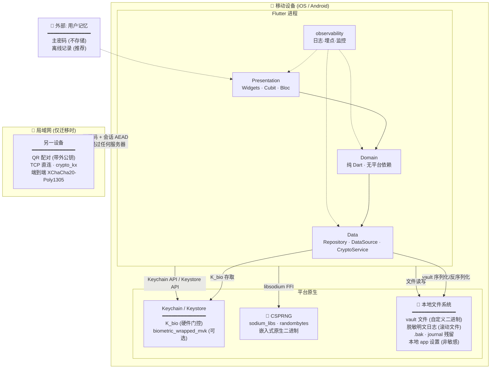
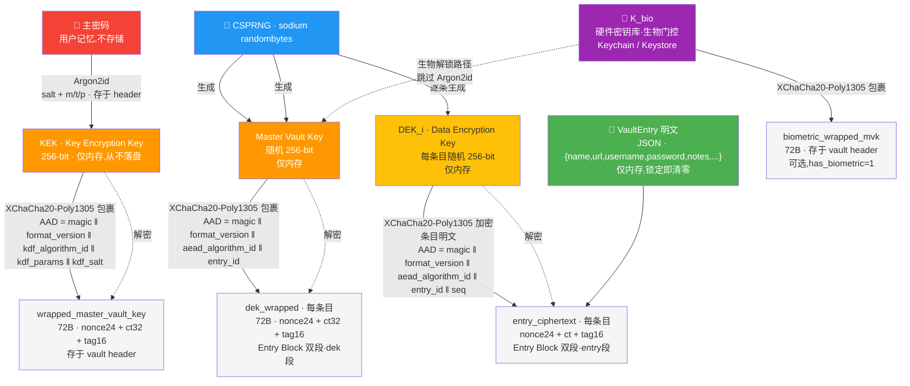
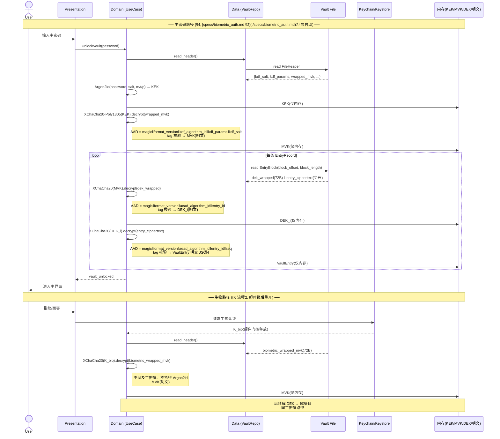

# 安全设计综述 · PROJECT_SW

> 本文档为 PROJECT_SW 的安全设计综述。详细规格已提取为独立子文档(见 [specs/](specs/)),本文只引用其结论与汇总视图。

## 1. 设计目标与信任边界

- **目标**:在设备本地完成所有加解密;即使本地密码库文件被窃取,在不知道主密码的前提下,攻击者无法离线还原明文。
- **信任边界**:设备本身(含其硬件密钥库)是唯一信任域。无任何后端、无云、无第三方托管。局域网迁移为受控的、临时性的跨边界通道。



> **节点说明**:
> - **Flutter 进程**:所有业务逻辑在设备本地完成,无网络依赖(迁移除外)。
> - **平台原生**:`sodium_libs` 为嵌入式原生二进制(嵌入式,非外部服务);`Keychain/Keystore` 由 OS 管,`K_bio` 可选设生物门控;vault 文件与日志均在本地文件系统。
> - **LAN 通道**:唯一跨信任边界数据流,经 QR 带外公钥 + `crypto_kx` 端到端加密,纯 P2P 无中转(§8 第 5 项)。
> - **用户记忆**:主密码是唯一不由系统存储的秘密(零知识),离线记录为推荐的缓解措施([specs/lock_and_recovery.md §3](./specs/lock_and_recovery.md))。
- **不保证**:设备已被 root/越狱、或恶意软件已拿到运行时内存时的绝对安全(此类场景超出本地应用可防御范围,见 §威胁模型)。

## 2. 加密方案(已定)

| 维度 | 选定 | 说明 |
|------|------|------|
| KDF | **Argon2id** | OWASP 2024 默认推荐,抗 GPU/ASIC |
| AEAD | **XChaCha20-Poly1305** | 192-bit nonce,随机 nonce 即安全,恒定时间 |
| 加密粒度 | **逐条信封加密(envelope)** | 每条目独立 DEK,支持局部更新与元数据加密 |
| 密码学库 | **`sodium_libs`**(libsodium 绑定) | 经广泛审计,全平台嵌入式二进制 |
| 密钥安全存储 | 系统 Keychain/Keystore(硬件背书) | 生物解锁路径使用 |

**选型理由摘要**:XChaCha20 的 24 字节 nonce 让随机 nonce 即可安全使用,几乎消除 nonce 重用风险——对缺乏专职安全审查的个人项目是关键降险。逐条信封加密与生物解锁、局域网迁移、本地搜索三大功能在架构上天然契合。完整选型对比与论证见会话记录(方案 A/B/C/D 对比)。

## 3. Argon2id 参数(起始值)

| 参数 | 起始值 | 说明 |
|------|--------|------|
| 内存 `m` | **64 MiB**(65536 KiB) | OWASP 现代档;低端 Android 可自适应下调至 19–46 MiB |
| 迭代 `t` | **3** | 与 m=64MiB 配合,目标派生耗时 250–400ms(待实测验证的设计假设,无 benchmark 引用;v0.1 实现时须以目标设备实测数据校准) |
| 并行 `p` | **1** | 移动端核心有限,p=1 更稳定;多核设备可 p=2 |
| 盐长度 | **16 字节** | 每库唯一,CSPRNG 生成 |
| 派生输出 | **32 字节**(256-bit) | 匹配 AEAD 密钥长度 |
| 自适应 | **是** | **首次建库时**(即第一次派生 KEK 前)在目标设备跑基准,在 ≤设定延迟(默认 1s)内选取最高档参数并持久化到 vault header |

参数与派生算法版本一并写入 vault header,支持未来无痛升级(见 §密钥与参数演进)。

## 4. 密钥层级

```
主密码(用户记忆,不存储)
   │  Argon2id(盐 + 参数,存于 vault header)
   ▼
KEK(Key Encryption Key,256-bit)─── 仅内存,从不落盘
   │  XChaCha20-Poly1305 包裹
   ▼
Master Vault Key(随机 256-bit)─── 密文存于 vault header
   │  XChaCha20-Poly1305 包裹每条
   ▼
DEK_i(Data Encryption Key,每条目随机 256-bit)─── 密文(dek_wrapped)随条目 Entry Block 存储([specs/vault_format.md §3](./specs/vault_format.md) 双段)
   │  XChaCha20-Poly1305 加密条目明文
   ▼
密文 VaultEntry_i
```



- **KEK**:由主密码派生,只存在于解锁后的内存;锁定/退出即清零。
- **Master Vault Key**:随机生成,是"换主密码不改密文"的关键——改主密码只需用新 KEK 重新包裹 Master Vault Key,无需重加密所有条目。
- **DEK**:每条目独立随机密钥,实现局部更新(改一条只重写该条 + 其 DEK 密文)、单条迁移、单条销毁。

### 4.1 解锁序列(主密码路径 + 生物路径)



## 5. 文件格式与加密存储

> **详见**: [Vault 文件格式规格](specs/vault_format.md) — 两层序列化、外壳字段规范(File Header / EntryRecord / Entry Block 双段)、free list 与崩溃安全 journal、三层 AAD 绑定、O(1) 更新语义

## 6. 生物解锁与认证强度

> **详见**: [生物解锁与认证强度](specs/biometric_auth.md) — 生物解锁机制(K_bio 门控、biometryCurrentSet)、认证强度策略(便捷档/强制主密码档/高敏操作枚举/风险立场)

## 7. 数据卫生

> **详见**: [数据卫生规范](specs/data_hygiene.md) — 内存与日志卫生、剪贴板 20s 自动清除 + iOS Handoff 禁用 + 平台后台限制

## 8. 局域网迁移

> **详见**: [局域网迁移协议规格](specs/lan_migration.md) — 安全要求 6 条、握手协议约束(QR 配对/crypto_kx/版本匹配/重包裹 seq 透传/目录双写原子提交/冲突策略整条覆盖)、迁移序列图

## 9. 本地搜索

> **详见**: [本地搜索规格](specs/local_search.md) — 解锁后内存内线性检索(基线)、匹配语义、字段卫生、custom_fields 搜索规则、为何不越过基线

## 10. 锁定、销毁与密码恢复

> **详见**: [锁定、销毁与密码恢复](specs/lock_and_recovery.md) — 超时锁定参数(空闲 5min/切后台立即锁)、忘记主密码策略(精确表述+缓解+显式排除)、忘码恢复通道(隐式应急+四重门槛)、死锁擦除逃生入口、12 状态状态机图

## 11. 威胁模型与缓解

| 威胁 | 缓解 |
|------|------|
| 密码库文件被窃取,离线暴力破解 | Argon2id(m=64MiB,t=3)显著抬高单次猜测成本;强主密码建议 |
| 密码库被篡改/损坏 | AEAD Poly1305 标签校验 + AAD 绑定(见 vault_format.md),失败即拒绝 |
| 条目被换槽/换条/回放旧版本 | AAD 绑定使 tag 与 entry_id/版本/算法绑定,移植或回放至错误位置校验失败(见 vault_format.md) |
| nonce 重用导致密文泄漏 | XChaCha20 24B 随机 nonce,碰撞概率可忽略;每次加密新生成 |
| 设备丢失 + 生物被冒用 | 生物识别由 OS/硬件把关(见 biometric_auth.md);主密码路径独立且为冷启动/高敏强制项;用户可配置禁用生物 |
| 运行时内存被恶意进程读取 | 及时清零、切后台锁定、敏感数据短生命周期;root/越狱设备不保证 |
| 日志/埋点泄漏明文 | 脱敏规范(见 data_hygiene.md),禁止记录敏感字段 |
| 局域网迁移被窃听/中间人 | 二维码带外公钥传递 + 临时会话密钥端到端加密 + transcript MAC(见 lan_migration.md) |
| 剪贴板泄漏 | 超时自动清除(当前固定 20s)+ 倒计时提示 + iOS 禁用通用剪贴板 Handoff(见 data_hygiene.md) |
| 第三方依赖漏洞 | 锁定依赖版本,定期审计,最小化依赖(见 DEVELOPMENT.md) |
| 生成密码可预测(弱随机源) | 生成器随机源与加密同源(`sodium_libs` `randombytes`)+ 无偏抽样;禁用伪随机(见 password_generator.md) |

## 12. 密钥与参数演进

- vault header 记录 `kdf_algorithm_id` / `kdf_params` / `format_version`(见 vault_format.md),解密时按记录参数执行,支持未来升级。
- 参数升级在解锁后用旧参数解密、用新参数重新包裹 MVK 即可,无需重加密条目。
- 算法替换:逐条信封架构允许渐进迁移;预留 `kdf_algorithm_id` / `aead_algorithm_id` 字段为前缀式派发,支持多算法并存过渡。
- 内层明文格式经 `plaintext_format_id` 逐条派发,可逐条迁移(如 JSON→CBOR),无需批量重加密。

## 13. 不在范围内

- 抵御已获 root/越狱且注入恶意代码的攻击者
- 抗量子计算(对称 256-bit 在可预见未来足够;不引入后量子算法)
- 云端零知识同步(本项目明确不做)
- 多用户/团队共享与权限模型

## 14. 待补全

- [x] ~~密码库文件序列化格式~~ → 已定:自定义二进制外壳 + JSON 内层(见 vault_format.md)
- [x] ~~局域网迁移握手协议~~ → 已定:二维码全通道+crypto_kx+版本匹配+重包裹+transcript MAC+原子提交(见 lan_migration.md)
- [x] ~~本地搜索索引方案~~ → 已评估不采纳:基线为最终方案(见 local_search.md)
- [x] ~~安全自检/防调试选项~~ → 已评估:降为实现期可选增强;若实现须仅告警不阻断

