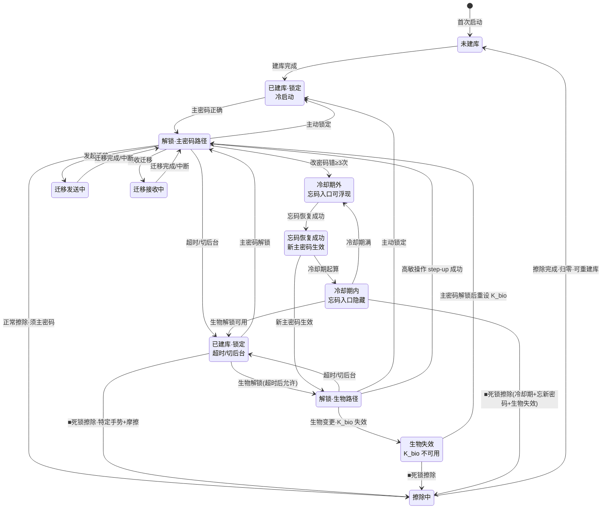

# 锁定、销毁与密码恢复 · PROJECT_SW

> 安全要求概述见 [SECURITY.md §10](../SECURITY.md)。
> 运行时会话模型以 [ADR-0010](../adr/0010-global-session-source-of-truth-and-step-up-auth.md) 为准。

## 1. 锁定与销毁

- **锁定**:清除内存中 KEK / Master Vault Key / DEK / `EntrySummary` / `EntryDetail` / 其他明文工作集,并作废未完成的 step-up challenge;UI 回到锁定态。
- **主密码修改**:用新主密码派生新 KEK,重新生成 kdf_salt(CSPRNG),仅重新包裹 Master Vault Key;条目密文不动。wrapped_master_vault_key 随 header 更新,biometric_wrapped_mvk 不变(MVK 未变)。
- **擦除**:提供显式擦除功能(应提供,非可选),分层:
  - 正常擦除(解锁态):须当时主密码(高敏操作)
  - 死锁擦除(锁定态,主密码与生物均不可用):不要求主密码,带摩擦(见 §4)
- 擦除覆盖:库文件、.bak/临时/journal 残留、本地日志文件,及 Keychain/Keystore 中的包裹密钥与 K_bio;须验证 Keychain 清除成功后再允许重新建库。

## 2. 超时锁定参数(已定)

当前版本:参数固定(简化),应用设置中可查看;未来版本开放可配置(已预留)。

| 参数 | 当前固定值 | 未来可选档位(预留) | 范围 | 可禁用 |
|------|-----------|-------------------|------|--------|
| **空闲超时**(前台无操作) | **5 分钟** | 1 / 5 / 15 / 30 分钟 · 从不 | [1, 60] 分钟 | ✓(选"从不") |
| **切后台超时**(应用退至后台) | **立即(0 秒)** | 立即 · 30 秒 · 60 秒 | [0, 300] 秒 | **✗(切后台必锁,长期护栏)** |

- **切后台立即锁定(当前固定)**:一切到后台即清零内存明文与密钥并锁定;接受"短暂切出再切回需重解锁"代价以守住内存卫生底线。
- **运行时语义**:切后台不是页面层顺手清理,而是会话真相源收到 `appBackgrounded` 后的即时锁定迁移;不等待 timer、路由或页面销毁。
- **切后台锁不可禁用(长期护栏)**:即使未来开放配置且空闲超时设为"从不",切后台仍必锁(可调延迟档,但不可禁用)。
- **"从不"仅限空闲超时**:选"从不"时 UI 须显式风险告知;切后台锁兜底仍生效。
- **超时后解锁**:超时锁定触发后,重新解锁仍允许生物;冷启动已配置生物时也允许生物,高敏操作强制主密码。
- **空闲计时**:仅前台累计;切后台时暂停空闲计时,回前台续计(或切后台即锁则无需续计)。
- **计时器所有权**:idle timer 由全局会话真相源统一启动、重置、销毁;页面只上报交互事件,不自行管理超时逻辑。
- **设置可见性**:当前固定值须在应用设置中展示(只读),并标注"未来版本可配置"。

## 3. 忘记主密码策略(已定)

**核心事实**:主密码 → Argon2id → KEK(仅内存,从不落盘)→ 解 MVK → 解 DEK → 条目。唯一能生成 KEK 的输入是主密码本身,故任何"找回"机制本质都是后门。找回在密码学上不可能,本节只管理其代价。

**精确表述**:忘主密码后能否访问数据,取决于生物路径是否仍通:

| 情形 | 忘主密码后能否访问数据 |
|------|----------------------|
| 已设生物解锁 + 生物特征未变 | **能**——生物路径经 K_bio 释放 MVK,不依赖主密码 |
| 已设生物解锁 + 生物特征变更/重置(K_bio 失效) | 不能 |
| 未设生物解锁 | 不能 |

故准确表述为:**「主密码与生物均不可用时,数据不可恢复」**,而非"忘主密码即不可恢复"。生物解锁是忘密码的隐性兜底——但此时数据安全由生物识别强度守护,非密码学锁死;UI 须如实告知此边界。

### 缓解措施

- **建库强化告知**:首次建库强制提示"主密码不可找回,请妥善记忆或离线记录",要求用户显式确认。
- **可记忆密码引导**:建库时引导选强且可记的密码,可借生成器 pronounceable 模式(见 [密码生成器规格](password_generator.md))生成可记密码。
- **定期复习提示**(可选):每 N 天提醒"请确认仍记得主密码",防生物场景下主密码静默遗忘。
- **冷启动生物/高敏强制主密码**(已锁):冷启动允许已配置生物并保留主密码回退;高敏操作仍须主密码 step-up。
- **LAN 迁移作为冷备**:引导用户把库迁移到第二设备;两设备可各自设定主密码或选相同;忘码恢复后须同步冷备。

### 显式排除(破坏安全模型或自相矛盾,不做)

- 主密码云端找回 / 本地加密备份找回:本质是后门,违反无后门原则。
- 安全问题找回:安全问题答案 = 弱密码,用它解锁 = 用弱 KEK 替代强 KEK。
- 主密码提示:悖论——提示存 vault 内需解锁才能看(忘密码时解不开),存 vault 外明文则要么泄露要么无用。

### 忘码恢复通道(隐式应急,已定)

密码学上,改主密码只需 MVK 明文 + 新主密码(重新包裹 MVK),旧主密码仅用于"经 KEK 解出 MVK";而生物路径可经 K_bio 独立取得 MVK。故已设生物且生物未变时,忘主密码后可经生物协助重置主密码,全程无需旧主密码。

- **salt 重生**:忘码恢复与常规改主密码均重新生成 kdf_salt(CSPRNG),消除旧 KEK 离线爆破面;wrapped_master_vault_key 随 header 更新,biometric_wrapped_mvk 不变(K_bio 与 MVK 均未变) 。
- **超时中断恢复**:忘码恢复流程中触发超时锁,重新生物解锁后在合理时间窗内可直接续接已开始的恢复流程(无需重新错误 3 次触发入口);当前窗口固定为 **10 分钟**,入口浮现后窗口内重试不重新计错次数,到期后自动隐藏并重置计数。
- **超时抑制边界**:忘码恢复进行中可抑制 idle timeout,但不抑制切后台立即锁定、手动锁定或生物失效。
- **忘码恢复后冷备同步**:忘码恢复重置主密码后,应提示用户同步更新冷备设备。

该通道为隐式应急设计,带四重门槛防生物冒用接管:

- **隐式不主动告知**:平时不暴露,仅在特定触发条件出现。
- **触发条件**:在「修改主密码」流程中,旧主密码连续验证错误 ≥3 次后,显示"忘密码恢复"入口(解锁失败不计入,仅改密码场景)。
- **冷却期(节流防试探)**:每次成功使用忘码恢复后起算一周冷却,期间入口不再显示。
- **额外摩擦**(进入恢复时):二次生物确认 + 强告知接管风险 + 新主密码走强度评估(见 [密码生成器规格](password_generator.md))。

**风险定性**:此通道放大了"设备丢失+生物冒用"的后果——从"仅能查看数据"升级为"可重置主密码永久接管"。代价以四重门槛控制,与生物残余风险同源。

## 4. 死锁擦除(逃生入口)

擦除是忘密码且生物不可用时的最后逃生手段(忘码恢复优先保数据;不可恢复时才擦除弃数据)。擦除分两路径:

- **正常擦除**(解锁态,主动管理数据):须当时主密码(高敏,防生物冒用清走全库)。
- **死锁擦除**(锁定态,主密码与生物均不可用时逃生):不要求主密码,为隐式应急通道,带四重摩擦:
  - **入口隐式不主动显示**:锁定态默认不暴露,须用户以特定手势(如连续点击锁屏标志 N 次)浮现;
  - **强告知**:"此操作将永久删除所有密码,不可恢复";
  - **二次显式确认**:要求键入特定词或勾选确认;
  - **延迟执行 + 倒计时**:点击后启动倒计时,期间可取消,超时才执行。

**风险定性**:死锁擦除放开"须主密码"会使生物冒用者能清库——但擦除是销毁而非窃取,冒用者得不到明文;与生物残余风险同量级接受。代价以四重摩擦控制。

## 5. 状态机

> **图例**:■ 标记的转换为死锁擦除逃生口。冷启动 S1 → 已配置生物时允许生物,否则走主密码 S3;超时锁 S2 → 允许生物;迁移期间 S9/S10 抑制 idle timeout 但不抑制切后台立即锁。`S4 -> S3` 表示已解锁会话内的 step-up success,不是重新锁定再解锁。该图保留的是粗粒度路由/流程视图;实际运行时会话状态还会额外携带更细的 lock reason 与 auth strength,由全局会话真相源统一驱动,`AuthCubit` 与 GoRouter 仅消费其派生结果。

### UI 告知义务

建库、设置生物解锁、高敏强制主密码时,均须如实告知忘密码的真实边界(生物兜底 vs 密码学锁死),不得简单宣称"忘密码就丢数据"。忘码恢复入口浮现时须强告知接管风险。
