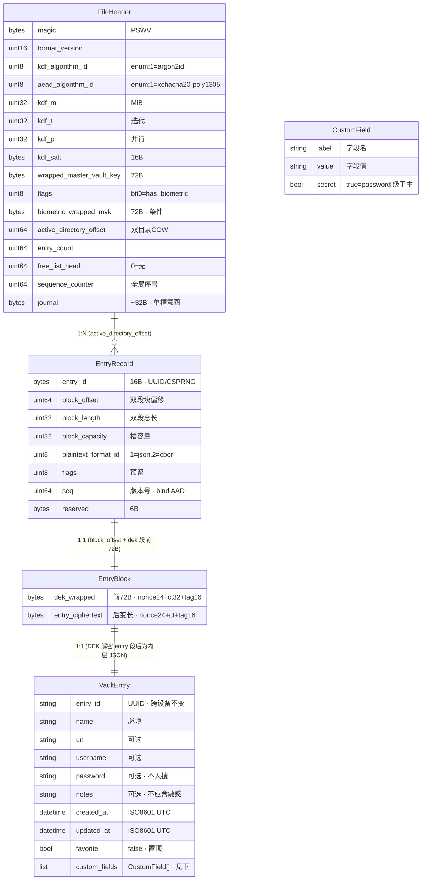

# VaultEntry 字段规格 · PROJECT_SW

> 规格概述见 [ARCHITECTURE.md §10](../ARCHITECTURE.md)；序列化外壳见 [SECURITY.md §5](../SECURITY.md)。

`VaultEntry` 为条目明文实体(domain 层,经 DEK 加密后存入 `entry_ciphertext`,见 [SECURITY.md §5](../SECURITY.md))。项目定位为**纯密码管理器**,不含 TOTP/2FA。

### 1. 固定字段

| 字段 | 类型 | 必填 | 可搜(SECURITY §9) | 说明 |
|------|------|------|----------|------|
| `entry_id` | UUID/CSPRNG(16B) | ✓ | — | 条目身份,跨设备不变;外壳 EntryRecord 持有,明文实体亦暴露 |
| `name` | String | ✓ | ✓ | 条目标识(如 "GitHub") |
| `url` | String | ✗ | ✓ | 服务地址 |
| `username` | String | ✗ | ✓ | 登录账号 |
| `password` | String | ✗ | **✗** | 密码;**不入可搜与列表展示**,仅详情页解密展示(SECURITY §9) |
| `notes` | String | ✗ | 可选 | 备注;可搜,故**不应填敏感信息** |
| `created_at` | ISO8601 UTC | ✓ | — | 创建时间 |
| `updated_at` | ISO8601 UTC | ✓ | — | 最近更新;用于排序与迁移冲突判新(SECURITY §8.1) |
| `custom_fields` | List<CustomField> | ✗ | 见下 | 自定义键值,见 §2 |
| `favorite` | bool | ✗ | ✓ | 收藏标记;true 时置顶展示(条目组织仅此一种,见 §5) |

> `password` 可选:支持纯 note 条目或仅有 username 的条目。`name` 为唯一必填业务字段。

### 2. 自定义字段(CustomField)

```dart
CustomField {
  label: String        // 字段名(如 "安全问题"、"备用邮箱"、"PIN")
  value: String        // 字段值
  secret: bool         // true = 敏感字段,按 password 级卫生处理
}
```

- **`secret: true` 的自定义字段**:与 `password` 同级卫生——**不入可搜集合、不入列表展示**,仅条目详情页按需解密展示(对齐 [SECURITY.md §9](../SECURITY.md))。
- **`secret: false` 的自定义字段**:非敏感,可入可搜(按 label/value 匹配)、可入列表展示。
- 存在意义:让用户区分敏感与非敏感附加信息,避免把敏感内容塞进 `notes`(notes 可搜,会意外暴露,见 [SECURITY.md §9](../SECURITY.md))。

### 3. 字段卫生汇总(对接 SECURITY §9 搜索)

| 字段类别 | 入可搜 | 入列表展示 | 详情页展示 |
|----------|--------|-----------|-----------|
| name / url / username | ✓ | ✓ | ✓ |
| notes | 可选 | 可选(截断) | ✓ |
| password | ✗ | ✗ | ✓(按需解密) |
| custom_fields(secret=true) | ✗ | ✗ | ✓(按需解密) |
| custom_fields(secret=false) | ✓ | ✓ | ✓ |
| favorite | ✓ | ✓(置顶) | ✓ |

### 4. 序列化(内层)

VaultEntry 明文经 SECURITY §5.1 内层 JSON 序列化为裸字节后喂入 AEAD;`entry_id`/`seq` 由外壳 EntryRecord 持有(SECURITY §5.3),内层 JSON 可选择是否冗余 `entry_id`(便于解码后校验一致性)。**字段级演进策略**:JSON 解析采用宽容模式(忽略未知字段,缺失字段取类型默认值——`favorite` 缺省为 `false`、`created_at`/`updated_at` 缺省为 epoch 等),新字段经应用升级自然生效,无需批量迁移;`plaintext_format_id` 只派发格式级(JSON→CBOR),不派发字段版本,字段演进依赖宽容解析而非格式版本号。

### 5. 条目组织(已定)

项目仅提供**收藏(flag)**一种条目组织维度,不做分类/文件夹/标签/嵌套树:

- `favorite: bool` 标记常用条目,列表页置顶展示;非敏感字段,可搜、可展示。
- **不做更重组织的原因**:个人库规模(几十~数百条)下,搜索(SECURITY §9)已能快速定位,分类/标签边际价值低;标签(多对多)与嵌套文件夹(树)会增实体与迁移复杂度(SECURITY §8.1 需迁组织结构),与"个人玩具 + 先简化"基调冲突。
- **演进预留**:未来若库变大、组织需求显现,可评估加单层 `category` 或 `tags`——`favorite` 字段不影响此演进。



> **关系说明**:
> `FileHeader`(`active_directory_offset`)→指向当前活跃 Directory→`EntryRecord[]`;
> `EntryRecord`(`block_offset`)→指向 `EntryBlock`(双段:前 72B `dek_wrapped` + 后变长 `entry_ciphertext`);
> `EntryBlock`→经 DEK 解密→`VaultEntry` 明文(内层 JSON)。`VaultEntry` 仅在解锁后内存存在,落盘即为 `entry_ciphertext` 密文。
